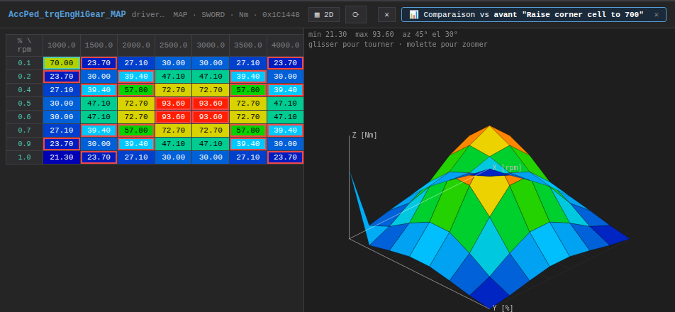
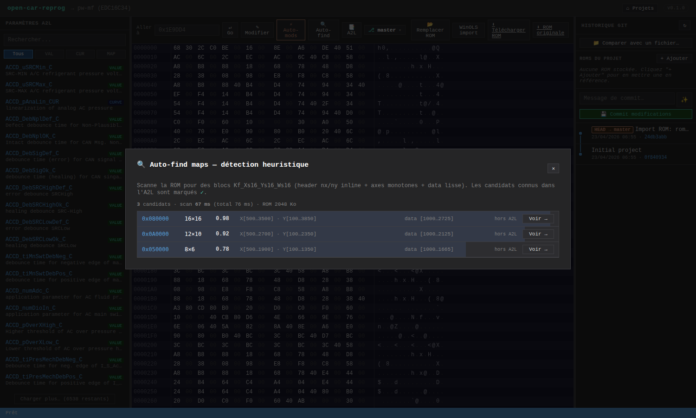
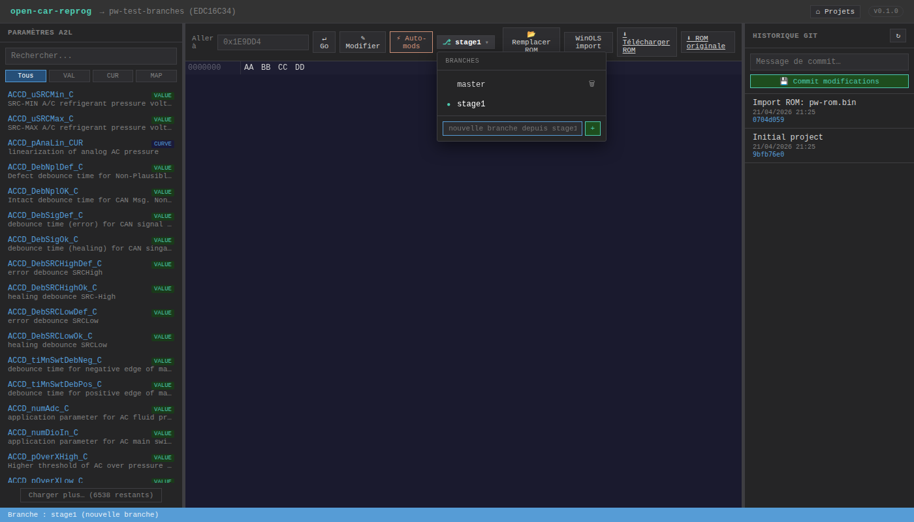
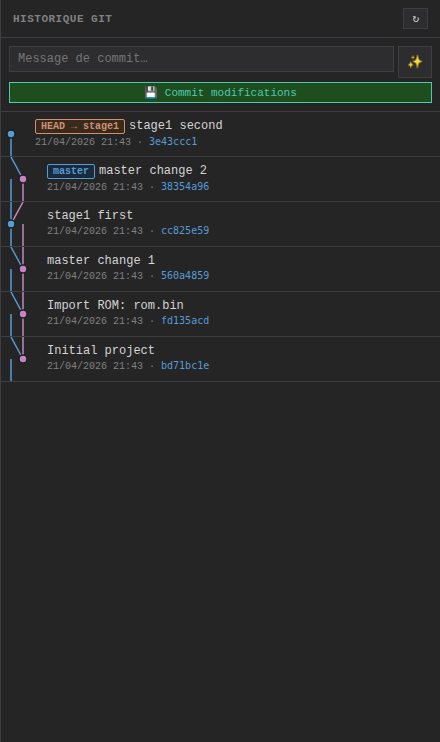
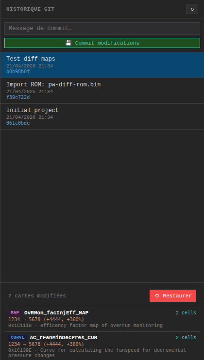
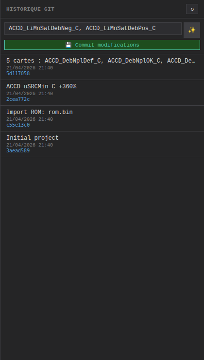
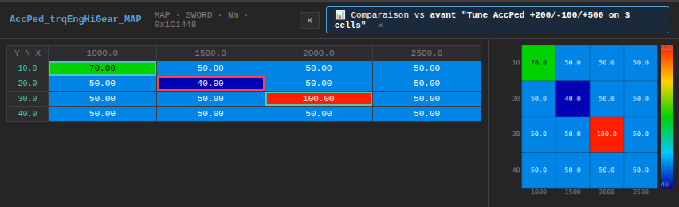
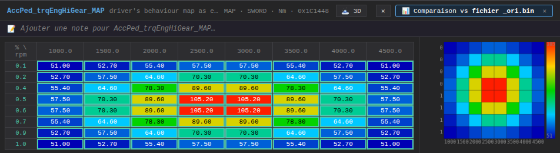

# open-car-reprog

> **v0.4.3** — Logiciel open-source de reprogrammation ECU, comparable à WinOLS, entièrement basé web.

Première cible : **Bosch EDC16C34** (toute la famille PSA 1.6 HDi 75/90/110 cv DV6TED4 — Berlingo / Partner / 206 / 207 / 307 / 308 / 407 / C3 / C4, plus Ford Fiesta TDCi et Mazda 2/3 MZ-CD), 12 autres ECUs déclarés dans le catalog (EDC17, ME7, MED17…).

Stack : **Node.js / Express** (back) + **Vanilla ES modules** (front, zéro build step) + **git** par projet pour toute la partie versionnement / comparaison / variantes.

🧬 **[open_damos](https://github.com/Poisson48/open_car_reprog/wiki/Open-DAMOS)** — alternative libre (CC0) au damos Bosch propriétaire, **auto-relocalise les maps par empreinte d'axes** : Stage 1 marche sur n'importe quel firmware EDC16C34 PSA sans acheter de damos dédié (50-200 € habituellement).

---

## Fonctionnalités

### ROM & éditeur
- **Import** `.bin`, `.hex` (Intel HEX), `.ols` (WinOLS ZIP), binaire brut
- **Backup original immuable** — `rom.original.bin` créé à l'import, jamais écrasé
- **Éditeur hexadécimal canvas** — virtual scroll sur 2 Mo (131k lignes), édition nibble par nibble
- **Base d'adresses configurable** — champ "Base adresses affichage (hex)" dans le modal d'édition
  du projet. Les ROMs dumpées avec un décalage mémoire (ex : flash mappée à `0x80000000`) peuvent
  afficher leurs adresses réelles dans l'hex editor et le "Go to" sans toucher au fichier.
- **Éditeur de cartographies** — heatmap 2D, sélection cellule / plage / ligne / colonne, ajustements ±%
- **Vue 3D** — bouton `🗻 3D` dans la toolbar de la carte : rendu surface colorée par altitude,
  rotation à la souris (az/el), bouton `⟳` pour réinitialiser la vue. Le tableau 2D reste éditable
  à côté ; modifier une cellule rafraîchit immédiatement la surface 3D.

  
- **Record layouts variés supportés** — le lecteur respecte le `RECORD_LAYOUT` A2L (présence/absence
  des `NO_AXIS_PTS_X/Y` inline, dimensions fixes via `maxAxisPoints`, COM_AXIS partagés). Un badge
  `⚠ Layout` s'affiche si l'en-tête nx/ny lu en ROM est illisible (ROM d'une autre version firmware).
- **6638 paramètres A2L** parsés depuis le DAMOS (cache JSON de 3,1 Mo généré au 1er démarrage)
- **Navigateur de paramètres** — recherche texte, filtres VALUE / CURVE / MAP / VAL_BLK, scroll infini

### Auto-détection de cartographies (Map-Finder)

Scanne la ROM pour des MAPs sans A2L. Fenêtre glissante, filtre les blocs dont
le header `(nx, ny)` est plausible + axes monotones + data lisse. Score par
smoothness / variance / taille préférée, tri décroissant, dédup des overlaps.

Utile quand :
- l'A2L est absent (ECU obscur) ou partiel
- on veut repérer des MAPs non documentées dans l'A2L officiel

~30 ms pour un scan complet de 2 Mo côté serveur. Clic sur un candidat → saut du hex editor + surlignage du bloc.



### Modifications automatiques (EDC16C34)
- **Templates véhicule** — presets one-click par famille de voiture (PSA 1.6 HDi 110 Stage 1 Safe,
  Stage 1 Sport + Pop&Bang, Dépollution OFF). Un seul bouton applique Stage 1 + Pop&Bang + auto-mods
  au choix du preset. Extensible : nouvelle entrée dans `src/vehicle-templates.js`.

  

- **Stage 1** — 5 cartes (accélérateur, couple, rail pressure, limiteur couple) avec % ajustable par carte
- **Pop & Bang** — seuil RPM sélectionnable (snappé aux points d'axe map Bosch) + quantité d'injection
- **DPF/FAP OFF**, **EGR OFF**, **Swirl OFF** — recherche signature + patch en 1 clic
- **🧬 Recettes auto-tune open_damos** — 6 recettes prédéfinies opérant sur les entries relocalisées :
  - **Speed Limiter OFF** — les 3 plafonds vitesse (régulateur / diag / propulsion) → 320 km/h
  - **Rev Limiter** — `AccPed_nLimNMR_C` → 5500 rpm (zone non-monitored relevée)
  - **Torque Limiter +30%** — `EngPrt_trqAPSLim_MAP` + `EngPrt_qLim_CUR` (évite le clamp Stage 1/2)
  - **Rail Pressure +15%** — plafond max à ~1800 bar pour Stage 2+
  - **Smoke limiter -5%** — FlMng_rLmbdSmk_MAP, autorise plus de fuel avant smoke cut diesel
  - **Full Dépollution** — AirCtl_nMin 8000 rpm + trq safety relevé

### Git-powered workflow

Le cœur du projet. Chaque projet est un repo git : historique, branches, restauration, diff sémantique.

- **Branches git** (`⎇ master ▾` dans la toolbar) — dropdown avec création, switch, suppression.
  Les changements non committés sont **auto-commités `WIP on <branche>`** avant de basculer →
  aucun travail perdu en switchant entre variantes de tune.

  

- **Graph des branches** dans l'historique — les commits sont dessinés en SVG avec une lane
  colorée par branche, diagonales aux points de divergence, badges `HEAD → stage1` / `master`
  inline dans le message :

  

- **Diff map-level** — quand on clique un commit dans l'historique, le panneau ne montre plus
  des octets bruts mais la **liste des cartes A2L modifiées**, avec type, nombre de cellules
  changées, et un échantillon valeur avant → après :

  

  Click sur une ligne → ouvre la carte dans l'éditeur + saute à son adresse dans l'hex editor.

- **Messages de commit auto-générés** — bouton `✨` à côté du champ message, ou focus sur le champ vide.
  Le serveur calcule le diff entre HEAD et la working tree, et propose :

  - 1 carte modifiée à l'endroit exact → `ACCD_uSRCMin_C +360%`
  - Plusieurs cartes → `5 cartes : ACCD_DebNplDef_C, ACCD_DebNplOK_C, …`
  - Pattern Stage 1 reconnu → `Stage 1 (5/5 cartes)`

  

- **Compare view** — quand on clique une carte dans la liste du diff d'un commit,
  l'éditeur s'ouvre en mode comparaison. Les cellules modifiées sont entourées
  de **vert** (augmentées) ou **rouge** (diminuées) par rapport au commit parent.
  Hover → tooltip `avant: 50 → actuel: 70 (+20)` :

  

- **Comparer avec un fichier externe** — bouton `📁 Comparer avec un fichier…`
  dans le panel Git : upload une seconde ROM (`.bin`/`.hex`) et voir instantanément
  la liste des cartes A2L qui diffèrent entre la ROM du projet et la référence.
  Click sur une carte → éditeur en mode compare, exactement comme pour un diff git.
  Cas d'usage typique : un client envoie son `tune.bin`, on le compare à l'`ori.bin`.

  

- **🔀 Comparer 2 commits / branches arbitraires** — bouton `🔀 Comparer 2 commits / branches…`
  dans le panel Git ouvre un modal avec 2 dropdowns (Avant A / Après B). Sélectionne
  deux refs (commits, branches, tags), le diff map-level s'affiche. Click sur une map →
  éditeur en compare mode entre les 2 refs. Idéal pour comparer `stage1` vs `stage2-launch`.

- **⇄ Split view** — en compare mode, bouton `⇄ Split` dans la bannière :
  - **2D** : 2 tableaux côte à côte (A lecture seule, B éditable), scroll synchronisé
  - **Heatmap** : canvas coupé en 2 quadrants, même min/max pour couleurs comparables
  - **3D** : 2 surfaces côte à côte avec rotations synchronisées, même échelle Z

- **📝 Liste cliquable des cellules modifiées** — en compare mode, bouton `📝 Modifs` :
  panneau flottant listant toutes les cellules qui diffèrent (triées par magnitude
  delta desc), format `[rpm, pédale] : before → after  ±Δ`. Click sur une ligne →
  scroll vers la cellule dans le tableau 2D avec **flash doré 1.5 s**.

- **🚦 Damos-match badge** — petit badge 🟢/🟠/🔴 dans la toolbar qui indique si
  le damos A2L matche ta ROM. 🔴 mismatch → open_damos prend le relais automatiquement
  via fingerprint (Stage 1 marche quand même). Click → détails (source damos, nb
  d'entries lisibles).

- **Restauration** — bouton `⟲ Restaurer` par commit pour revenir à n'importe quel état.

- **Undo / Redo** — `Ctrl-Z` défait la dernière édition (cellule ou lot `±%`), `Ctrl-Shift-Z` /
  `Ctrl-Y` la refait. Un lot (ex : `+5%` sur 16 cellules) = une seule étape. La pile est vidée
  à chaque rechargement de ROM (restore, switch de branche).

- **Copier / coller entre cartes** — `Ctrl-C` copie les valeurs physiques de la sélection
  courante (rectangle englobant avec "trous" respectés), `Ctrl-V` colle dans la sélection de
  la carte cible (ancrée sur le coin haut-gauche). Marche entre deux cartes différentes :
  sélection dans la carte A, `Ctrl-C`, ouvrir la carte B, sélectionner la zone cible, `Ctrl-V`.
  Le collage est une opération atomique → un seul `Ctrl-Z` pour tout annuler.

- **Lisser / Égaliser / Rampe** — 3 boutons sur la barre de sélection :
  - `Lisser` : moyenne glissante 3×3 sur les cellules sélectionnées (adoucit les transitions).
  - `Égaliser` : remplace toutes les cellules de la sélection par leur moyenne (mise à plat).
  - `Rampe` : interpolation bilinéaire depuis les 4 coins actuels de la sélection
    (pratique pour lisser un dégradé brusque).

- **Slice viewer** — click sur un en-tête de ligne ou de colonne d'une MAP →
  ouvre un modal avec la courbe de cette tranche (Chart.js). Pratique pour
  vérifier rapidement qu'une ligne de RPM ou une colonne de couple a une forme
  monotone sans zig-zags. `Esc` ou click hors modal pour fermer.

  

- **Notes par carte** — une note libre est associée à chaque carte affichée
  (input sous la toolbar, input vide supprime la note). Sauvegarde serveur
  automatique au blur/Enter, persiste entre sessions et rechargements.
  Pratique pour garder trace des essais : *"+15% stage 1, OK banc 2026-04"*.

  

- **A2L / DAMOS custom par projet** — bouton `📑 A2L` dans la toolbar ouvre une
  modal de gestion : **uploader** un `.a2l` custom, **supprimer** le custom (retour
  au catalog), **télécharger** l'open_damos A2L relocalisé pour cette ROM.
  L'A2L custom remplace le catalog dans la sidebar ; son nom apparaît dans le
  fil d'ariane. Le badge damos-match se rafraîchit automatiquement après un upload.

- **🧬 Export open_damos A2L** — bouton `🧬 open_damos` dans la toolbar télécharge
  un fichier `.a2l` ASAP2 standard **relocalisé pour ta ROM** (adresses trouvées
  par fingerprint). Utilisable dans WinOLS / TunerPro / EcuFlash. Pour le Berlingo
  SW 1037383736, un fichier pré-construit est inclus dans le repo :
  `ressources/edc16c34/firmwares/9663944680_sw1037383736.a2l`.

- **Multi-ROMs par projet** — section *ROMs du projet* dans le panel Git :
  ajoute autant de ROMs de référence que nécessaire (dumps clients, versions
  d'autres tuneurs…). Un click sur `📊` déclenche une comparaison de la ROM
  active contre le slot → liste des cartes qui diffèrent, ouverture en mode
  compare dans l'éditeur. Les slots sont stockés en local par projet et
  restent hors git (ils ne polluent pas l'historique de tune).

---

## Installation

```bash
git clone https://github.com/Poisson48/open_car_reprog
cd open_car_reprog
npm install
node server.js           # production
node --watch server.js   # dev (hot reload)
```

→ **http://localhost:3000**

> Node 18+ requis.

### One-shot sur Ubuntu

```bash
./run.sh              # pull + npm install si besoin + serveur :3002 + ouvre navigateur
./run.sh --no-pull    # skip git pull (WIP local)
./run.sh --no-open    # pas de navigateur (headless)
PORT=3005 ./run.sh    # port perso
```

---

## Workflow type

1. **Créer un projet** → nom + immatriculation + véhicule + choix ECU
2. **Importer la ROM** → drag-n-drop sur le workspace
3. **Explorer les paramètres** → sidebar gauche, filtrer par `DPF`, `EGR`, `boost`, nom de carte…
4. **Tuner**
   - soit à la main : click paramètre → éditeur de carte → sélection + `-5%` / `+10%`
   - soit automatique : bouton `⚡ Auto-mods` → Stage 1, Pop & Bang, DPF OFF, etc.
5. **Sauver & committer** → `Ctrl+S` pour patcher les octets, puis commit depuis le panneau git
6. **Variantes de tune** → créer une branche `stage2` depuis la toolbar, essayer, comparer
7. **Revenir en arrière** → click commit → `⟲ Restaurer`, ou switch de branche

---

## Architecture

```
server.js                   Express REST API (API listée plus bas)
run.sh                      One-liner pull + start (Ubuntu)
src/
  ecu-catalog.js            13 ECUs déclarées (EDC16/EDC17/ME7/MED17)
  a2l-parser.js             Parser ASAP2/DAMOS récursif → 6638 caractéristiques
  project-manager.js        CRUD projets sur filesystem (projects/<uuid>/)
  git-manager.js            Git par projet (branches, diff, restore, log, auto-commit WIP)
  map-differ.js             Calcule quelles caractéristiques A2L diffèrent entre 2 buffers
  map-finder.js             Détection heuristique de MAPs sans A2L (scan layout Kf_Xs16_Ys16_Ws16)
  rom-patcher.js            Patch map Kf_Xs16_Ys16_Ws16 (SWORD big-endian)
  winols-parser.js          Import ZIP / Intel HEX / binaire brut
  vehicle-templates.js      Templates véhicule (presets one-click par famille)
  open-damos.js             Relocator par empreinte d'axes (fingerprint) + anchor
  open-damos-a2l-export.js  Export A2L ASAP2 standard (baseline + relocated)
  open-damos-recipes.js     6 recettes auto-tune (speed limiter OFF, rev limit, torque, rail, smoke, full dépollution)
public/
  index.html                SPA shell
  css/app.css               Dark VSCode-like theme
  js/
    app.js                  Router hash
    api.js                  Wrapper fetch REST
    views/home.js           Grille projets
    views/project.js        Workspace
    components/
      hex-editor.js         Canvas + virtual scroll
      map-editor.js         Heatmap + édition
      param-panel.js        Sidebar paramètres A2L
      git-panel.js          Historique + diff map-level + restore
      branch-switcher.js    Dropdown branches
      auto-mods.js          Stage 1 / Pop&Bang / DPF / EGR / …
ressources/
  edc16c34/
    damos.a2l               Fichier DAMOS Bosch EDC16C34 (440k lignes, ori.BIN = match 100%)
    damos.cache.json        Cache parser (3,1 Mo, gitignored)
    open_damos.json         open_damos v1.2.0 — 24 entries CC0 avec fingerprints d'axes
    OPEN_DAMOS.md           Philosophie + contribution guide
    firmwares/
      9663944680_sw1037383736.a2l   A2L pré-construit Berlingo II 75cv (77 KB, 175 chars)
      9663944680_sw1037383736.json  open_damos composite avec adresses relocalisées
tests/
  branch-switcher.test.js         Test Playwright — branches
  diff-map-level.test.js          Test Playwright — diff map-level
  open-damos.test.js              Régression relocation ori.BIN + Berlingo + random
  ecu-catalog-edc16c34.test.js    Garde-fou Stage 1 addresses sur ori.BIN
  berlingo-stage1-e2e.test.js     E2E Playwright Berlingo (badge + Stage 1 + 1707 bytes)
```

---

## API REST (résumé)

| Méthode | Route | Description |
|---------|-------|-------------|
| GET | `/api/projects` | Lister |
| POST | `/api/projects` | Créer |
| GET/PATCH/DELETE | `/api/projects/:id` | CRUD |
| POST | `/api/projects/:id/rom` | Importer ROM |
| GET | `/api/projects/:id/rom` | Télécharger |
| PATCH | `/api/projects/:id/rom/bytes` | Patcher octets (base64) |
| POST | `/api/projects/:id/git/commit` | Commit |
| GET | `/api/projects/:id/git/log` | Historique |
| GET | `/api/projects/:id/git/diff/:hash` | Diff binaire (legacy) |
| GET | `/api/projects/:id/git/diff-maps/:hash` | **Diff map-level** |
| GET | `/api/projects/:id/git/diff-maps-head` | Diff HEAD vs working tree |
| GET | `/api/projects/:id/git/diff-maps-between/:refA/:refB` | **Diff map-level entre 2 refs arbitraires** |
| POST | `/api/projects/:id/git/restore/:hash` | Restaurer |
| GET | `/api/projects/:id/git/branches` | Lister branches |
| POST | `/api/projects/:id/git/branches` | Créer branche |
| PUT | `/api/projects/:id/git/branches/:name` | Switch (auto-commit WIP) |
| DELETE | `/api/projects/:id/git/branches/:name` | Supprimer |
| GET | `/api/projects/:id/a2l/match` | **Damos-match score** (0-100, status match/partial/mismatch) |
| POST | `/api/projects/:id/a2l` | Upload A2L custom |
| DELETE | `/api/projects/:id/a2l` | Supprimer A2L custom |
| GET | `/api/ecu/:ecu/open-damos.a2l` | **open_damos A2L baseline** |
| GET | `/api/projects/:id/open-damos.a2l` | **open_damos A2L relocalisé** pour cette ROM |
| GET | `/api/open-damos/recipes` | Liste des recettes auto-tune |
| POST | `/api/projects/:id/open-damos-recipe/:id` | **Appliquer une recette** (speed_limiter_off, smoke_off, torque_limiter_off, rev_limit_raise, rail_max_raise, full_depollution) |
| GET | `/api/ecu` | Catalog ECU |
| GET | `/api/ecu/:ecu/parameters` | Params A2L (search, type, offset, limit) |
| GET | `/api/ecu/:ecu/parameters/:name` | Param détaillé |
| POST | `/api/projects/:id/stage1` | Stage 1 auto (cascade A2L custom → A2L catalog → open_damos fingerprint → catalog) |
| POST | `/api/projects/:id/popbang` | Pop & Bang |

---

## Format ROM — Kf_Xs16_Ys16_Ws16 (Bosch DAMOS)

Layout à l'adresse `A` (SWORD big-endian) :

```
A+0              : nx (nb points axe X)
A+2              : ny (nb points axe Y)
A+4              : axe X [nx × SWORD]
A+4+nx*2         : axe Y [ny × SWORD]
A+4+nx*2+ny*2    : données [nx × ny × SWORD]
```

---

## Tests automatisés

```bash
node server.js &            # ou PORT=3001 pour éviter les conflits
node tests/branch-switcher.test.js
node tests/diff-map-level.test.js
node tests/auto-commit-msg.test.js
node tests/git-graph.test.js
node tests/map-compare.test.js
```

Chaque test Playwright génère des screenshots dans `tests/screenshots/` (gitignorés).

---

## Calculateurs supportés

| ECU | Véhicule | A2L catalog | open_damos | Stage 1 | Pop&Bang | Recettes |
|-----|----------|-------------|------------|---------|----------|----------|
| **EDC16C34** | PSA 1.6 HDi 75/90/110 cv DV6TED4 (Berlingo, Partner, 206/207/307/308/407, C3/C4, Fiesta TDCi, Mazda 2/3 MZ-CD) | ✅ | ✅ (24 entries v1.2.0) | ✅ | ✅ | ✅ 6 recettes |
| EDC17C46, EDC17CP44, ME7.x, MED17.x, … | 12 autres | déclarés dans catalog | à compléter | à compléter | à compléter | — |

---

## Contribuer

Pour ajouter un ECU :
1. Poser le `.a2l` dans `ressources/<nom>/damos.a2l`
2. Renseigner l'entrée dans `src/ecu-catalog.js` (`stage1Maps`, `popbangParams`, `autoModPatterns`)
3. Tester via l'UI

---

## Licence

MIT
