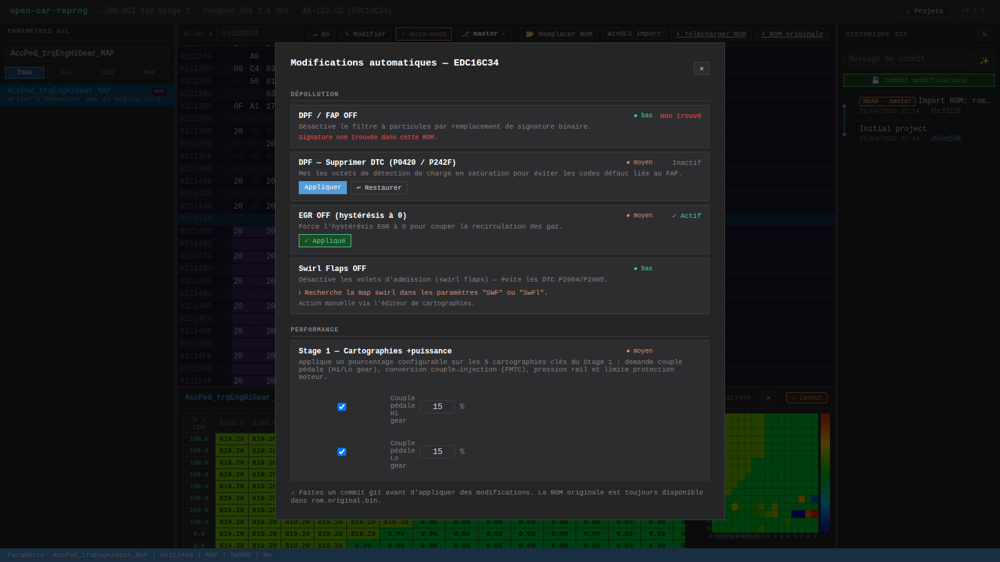

# Auto-mods



Le bouton **`⚡ Auto-mods`** de la toolbar ouvre la boîte à outils de modifications automatiques. Toutes les adresses et signatures sont **confirmées** sur EDC16C34 (Bosch, PSA 1.6 HDi 110 cv, calculateur des 206, 307, 308, Partner).

La modal est structurée en plusieurs sections :
1. **🚗 Templates véhicule** — presets one-click qui bundlent Stage 1 + Pop&Bang + auto-mods cohérents pour une famille de voiture. Voir [Templates véhicule](Templates-vehicule).
2. **🧬 Recettes open_damos** — **6 recettes prédéfinies** qui patchent automatiquement plusieurs entries open_damos relocalisées (marchent cross-firmware sans damos dédié). Section ci-dessous.
3. **Modifications individuelles** — Stage 1 personnalisable, Pop & Bang, DPF/EGR/Swirl. Documentées ci-après.

---

## 🧬 Recettes auto-tune open_damos

Chaque recette applique une liste d'opérations (patch de MAP, modification de VALUE, etc.) sur les entries **open_damos relocalisées** pour la ROM du projet. Marche sur n'importe quel firmware EDC16C34 PSA dès qu'il y a match fingerprint, sans damos dédié.

| Recette | Risk | Effet | Opérations |
|---------|------|-------|-----------|
| 🏁 **Speed Limiter OFF** | low | 3 plafonds vitesse → 320 km/h | `VSSCD_vMax_C`, `CrCCD_vSetSpdMax_C`, `PrpCCD_vSetSpdMax_C` = 320 km/h |
| 🔄 **Rev Limiter** | low | Seuil régime non-monitored → 5500 rpm | `AccPed_nLimNMR_C` = 5500 |
| 💪 **Torque Limiter +30%** | medium | Plafonds protection couple relevés | `EngPrt_trqAPSLim_MAP` +30%, `EngPrt_qLim_CUR` +25% |
| ⛽ **Rail Pressure +15%** | medium | Plafond max ~1800 bar (Stage 2+) | `Rail_pSetPointMax_MAP` +15% |
| 💨 **Smoke Limiter -5%** | medium | Plus de fuel autorisé avant smoke cut diesel | `FlMng_rLmbdSmk_MAP` -5% |
| ☢️ **Full Dépollution** | low | EGR OFF définitif + trq safety relevé | `AirCtl_nMin_C` = 8000 rpm, `AccPed_trqNMRMax_C` = 250 Nm |

Chaque recette, après application, retourne le détail : adresse touchée par entry, méthode (`setPhys`, `addPct`, `setMapAll`), cellules changées, ou erreur si l'entry n'a pas été relocalisée.

**Endpoints** :
- `GET /api/open-damos/recipes` — liste + métadonnées (id, nom, risk, description)
- `POST /api/projects/:id/open-damos-recipe/:recipeId` — applique sur la ROM active

Code : `src/open-damos-recipes.js`. Ajouter une recette = 5 lignes (id, nom, risk, description, ops).

---

---

## Stage 1

Préset "gain de puissance" — augmente le couple moteur, la quantité de carburant injectée et la pression rail. Gains typiques : **+20 à +30 ch / +40 à +60 Nm** sur 1.6 HDi 110 cv.

5 cartes sont modifiées, avec un **pourcentage ajustable par carte** :

| Map | Adresse | Rôle | % par défaut |
|-----|---------|------|--------------|
| `AccPed_trqEngHiGear_MAP` | `0x16D6C4` | Couple demandé accélérateur haut rapport | **+15%** |
| `AccPed_trqEngLoGear_MAP` | `0x16DA04` | Couple demandé accélérateur bas rapport | **+15%** |
| `FMTC_trq2qBas_MAP` | `0x1760A4` | Conversion couple → quantité carburant | **+12%** |
| `Rail_pSetPointBase_MAP` | `0x17A4A4` | Pression rail cible | **+10%** |
| `EngPrt_trqAPSLim_MAP` | `0x1758E4` | Limiteur couple protection moteur | **+25%** |

Tu peux :
- **Laisser à `0`** un pourcentage pour ne pas toucher cette carte
- **Réduire** les valeurs pour un Stage 1 "light" (prudent pour l'embrayage)
- **Augmenter** au-delà pour un Stage 2 fait maison (à tes risques — suivre en datalog recommandé)

Après validation, chaque carte est patchée en utilisant `applyPctToMap()` de `src/rom-patcher.js` qui :
1. Lit le `RECORD_LAYOUT Kf_Xs16_Ys16_Ws16` à l'adresse (`nx, ny, axes, data`)
2. Multiplie chaque cellule de la grille `data[]` par `1 + pct/100`
3. Clamp à SWORD `[-32768, 32767]`
4. Ré-écrit en place, big-endian

---

## Pop & Bang

Génère des pétarades à la décélération en injectant une quantité de carburant dans l'échappement. Les RPM et la quantité sont paramétrables :

| Paramètre | Adresse | Valeur stock | Rôle |
|-----------|---------|--------------|------|
| `AirCtl_nOvrRun_C` | `0x1C4046` | 1000 tr/min | **Seuil RPM** à partir duquel la décélération déclenche l'injection |
| `AirCtl_qOvrRun_C` | `0x1C40B4` | 0 (raw) | **Quantité** de carburant injecté en mg×10 |

Recommandations de départ :
- RPM : `3000` à `5000` (plus bas = pétarades plus fréquentes)
- Quantité : `5` à `20` (au-delà risque casse catalyseur)

**⚠ Attention** : les pétarades peuvent endommager le turbo et le catalyseur. À utiliser avec modération et idéalement avec downpipe + cata sport.

---

## DPF / FAP OFF

Désactive le filtre à particules. Utile quand le FAP est bouché / déposé / remplacé par une ligne straight pipe.

**Deux modifications nécessaires** :

### 1. Désactivation logicielle — signature 17 octets

Recherche dans le ROM de la séquence :
```
7F 00 00 00 00 00 00 00 00 02 01 01 00 0C 3B 0D 03   ← FAP ON
```

Et remplace par :
```
7F 00 00 00 00 00 00 00 00 02 00 00 00 0C 3B 0D 03   ← FAP OFF
```

(seuls les 2 octets au milieu passent de `01 01` à `00 00`).

La recherche est un simple scan O(n) sur les 2 Mo du ROM — ça prend ~10 ms.

### 2. Neutralisation des DTC DPF

Adresse `0x1E9DD4` — 16 bits. Patch à `0x0000` pour désactiver les codes défaut liés au FAP (sinon la ligne MIL reste allumée).

---

## EGR OFF

Désactive la vanne de recirculation des gaz d'échappement. Recommandé pour libérer le couple bas régime et éviter le bouchage de l'admission.

**Adresse : `0x1C4C4E`** — patch valeur à `0x00`.

Le tuto d'origine : https://www.ecuconnections.com/forum/viewtopic.php?t=48143

---

## Swirl OFF

Désactive les volets d'admission (swirl flaps) — ceux qui cassent et finissent dans le moteur sur les vieux PSA.

Détection et patch automatiques.

---

## Speed limiter OFF

Supprime le bridage Vmax.

Détection de la constante vitesse max dans la ROM (généralement stockée à une adresse connue) et override à la valeur maximale.

---

## Workflow recommandé

1. **Importer le ROM** stock dans un projet neuf
2. **Committer** l'import (fait automatiquement lors de l'import)
3. **Créer une branche** `stage1` (via `⎇ master ▾`)
4. **Appliquer Stage 1** avec les pourcentages par défaut
5. **Commit** avec `✨` qui génère automatiquement `Stage 1 (5/5 cartes)`
6. Si tu veux tester : **nouvelle branche** `stage1-light` → Stage 1 à +10% au lieu de +15%
7. **Compare** les branches via le graph git
8. **Exporter le `.bin`** et flasher via MPPS

---

## Étendre Auto-mods à un autre ECU

Éditer `src/ecu-catalog.js` et ajouter une entrée :

```js
'edc17c46': {
  id: 'edc17c46',
  name: 'Bosch EDC17C46',
  a2l: 'ressources/edc17c46/damos.a2l',
  stage1Maps: [
    { name: 'AccPedTrq_MAP', address: 0x..., defaultPct: 15 },
    // …
  ],
  popbangParams: {
    nOvrRun: { address: 0x..., min: 1000, max: 8000 },
    qOvrRun: { address: 0x..., min: 0, max: 500 }
  },
  autoModPatterns: {
    dpfOff: { search: [...], replace: [...] },
    egrOff: { address: 0x..., value: 0x00 }
  }
}
```

Les adresses doivent être **confirmées en ROM** — soit par comparaison avec un ROM tuné connu, soit par reverse sur les symboles A2L.

Voir aussi : [ECUs supportés](ECUs-supportes).
