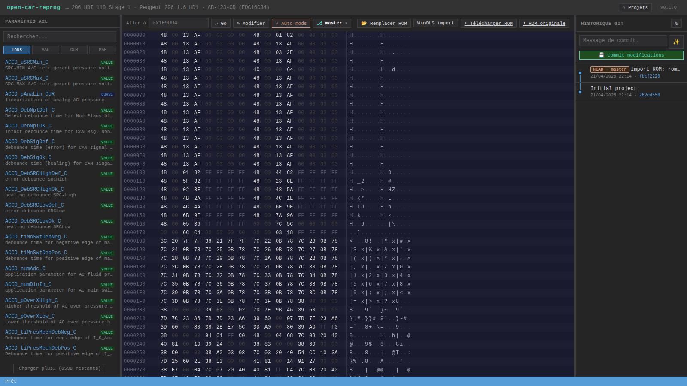
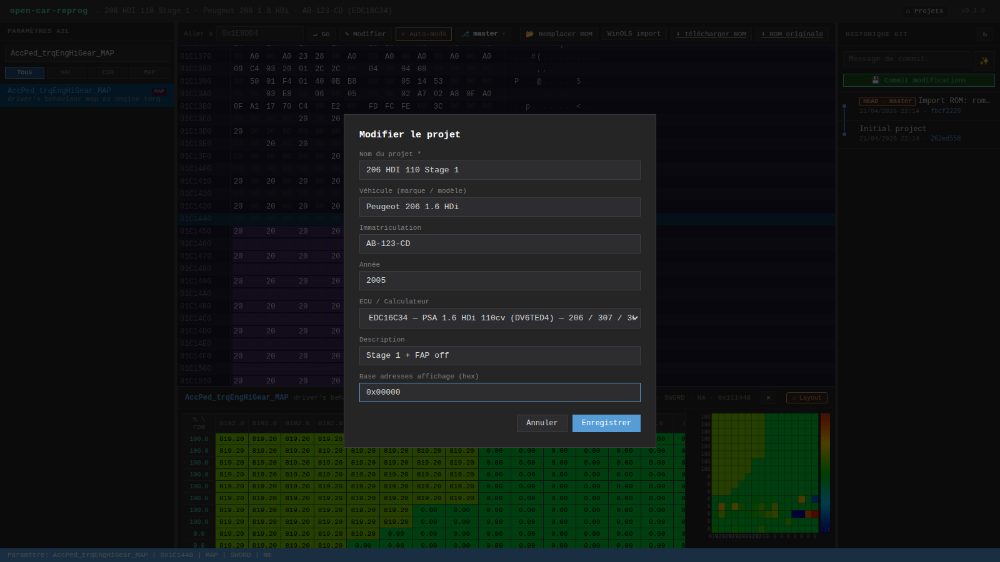

# Éditeur Hex

L'éditeur hex occupe la partie centrale-haute du workspace. Canvas HTML5 avec **virtual scroll** : sur un ROM de 2 Mo (131 072 lignes), seules les ~30 lignes visibles sont redessinées, ce qui reste fluide même en scrollant rapidement.

## Colonnes

De gauche à droite :
- **Adresse** (7 hex chars) — s'ajuste à la `displayAddressBase` du projet si définie
- **Octets** (16 par ligne, séparés en 2 groupes de 8)
- **ASCII** (16 caractères, `.` pour non-imprimable)

## Codes couleur

- **Gris foncé** : octet `0x00`
- **Gris clair** : octet `0xFF`
- **Blanc** : octet normal
- **Orange** : octet **modifié non sauvegardé**
- **Bleu** : octet sélectionné
- **Violet / surbrillance** : zone d'un paramètre A2L actif (après clic sur un param dans la sidebar)

## Navigation

- **Scroll souris** : molette (fonctionne même sur les zones hex/ascii grâce au forwarding des events `wheel`)
- **Champ "Aller à"** (toolbar) : saisir une adresse hex (ex `1E9DD4` ou `0x1E9DD4`) puis Entrée ou clic **Go**.
  Validation stricte depuis v0.5.0 : une saisie non-hex (`zzz`, `123g`) ou hors ROM (`FFFFFFFF` sur un
  dump 2 Mo) est rejetée avec une bordure rouge sur l'input + un message dans la status bar
  (*"Adresse invalide"* ou *"Adresse 0x… hors ROM (taille : 2097152 octets)"*). L'erreur disparaît
  dès que tu reprends la saisie.
- **Click sur un paramètre A2L** (sidebar gauche) : l'hex editor saute à l'adresse du paramètre

## Édition

- **Click** sur un octet → sélectionné (curseur bleu)
- **Touches hex** (`0-9`, `a-f`) → modifie nibble haut puis nibble bas
- `Tab` / flèches → passer à l'octet suivant
- **Esc** → désélectionne

Les modifs sont **en mémoire uniquement** tant que tu n'appuies pas `Ctrl+S`. Le compteur d'octets modifiés est affiché dans la barre de statut (bas de la fenêtre) : `Modifié: 0x1E9DD4 = 0xFF | 3 byte(s) non sauvegardé(s)`.

## Base d'adresses configurable

Certains ROM sont dumpés avec un décalage mémoire — par exemple une flash physique mappée à `0x80000000` dans l'espace d'adressage du MPC5xx, mais le fichier `.bin` commence à l'offset 0. Les forums et WinOLS utilisent les **adresses mémoire réelles**, ce qui ne match pas ce que tu vois par défaut dans l'hex editor.

La feature `Base adresses affichage` règle le problème :

- Valeur hex dans le champ **Base adresses affichage (hex)** du modal d'édition du projet (ex : `0x80000000`)
- La colonne adresse de l'hex editor affiche `base + file_offset` au lieu de `file_offset`
- Le champ `Aller à` comprend alors des adresses `0x800016D6` et cherche au bon offset fichier

C'est un **décalage purement visuel** — les octets du fichier ne sont pas déplacés, seul l'affichage change. Laisser vide si les adresses A2L matchent déjà le fichier (cas standard EDC16C34).

## Raccourcis

| Touche | Action |
|--------|--------|
| `Ctrl+S` | Envoie tous les octets modifiés au backend (écrit `rom.bin` sur disque) |
| `0-9` / `a-f` | Édite le nibble sélectionné |
| Flèches / Tab | Navigue entre octets |
| Esc | Désélectionne |
