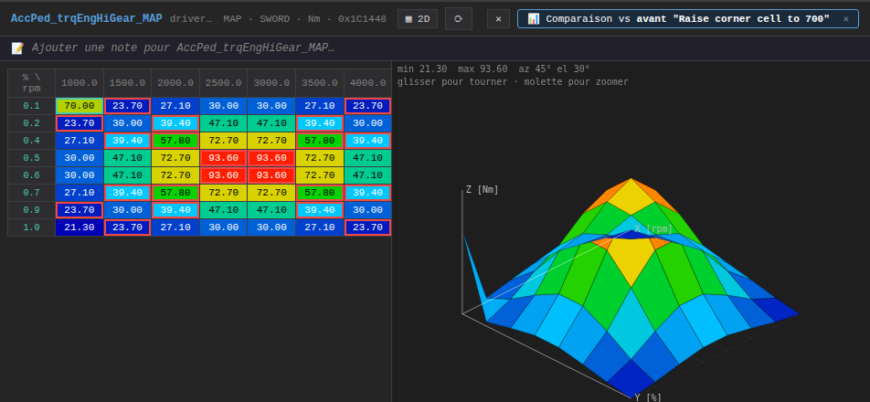
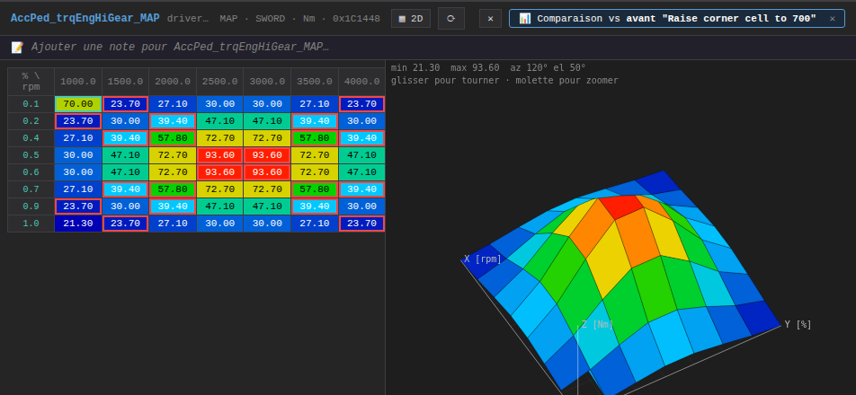
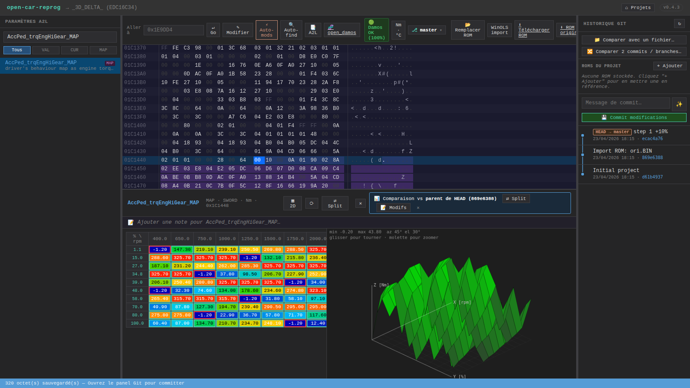
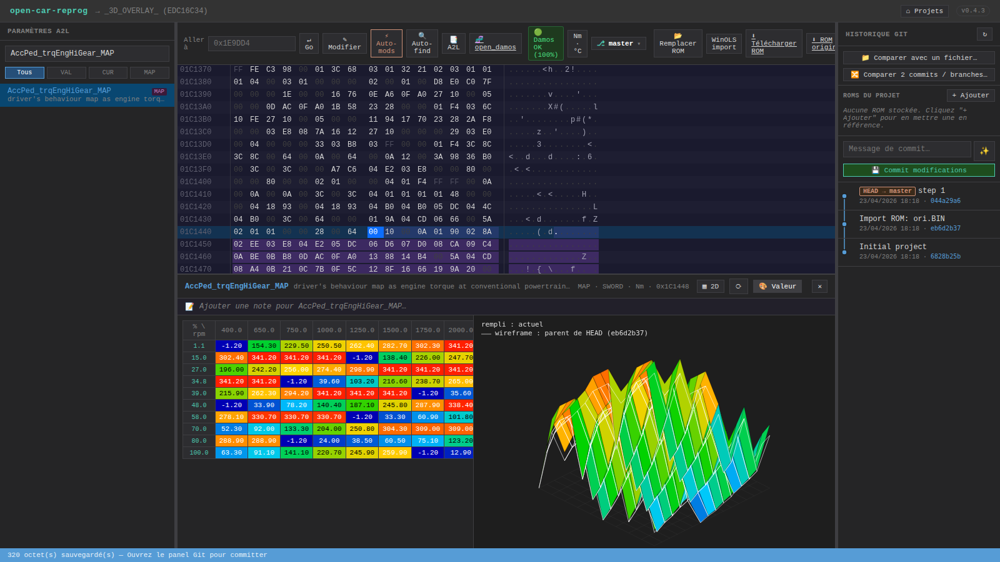
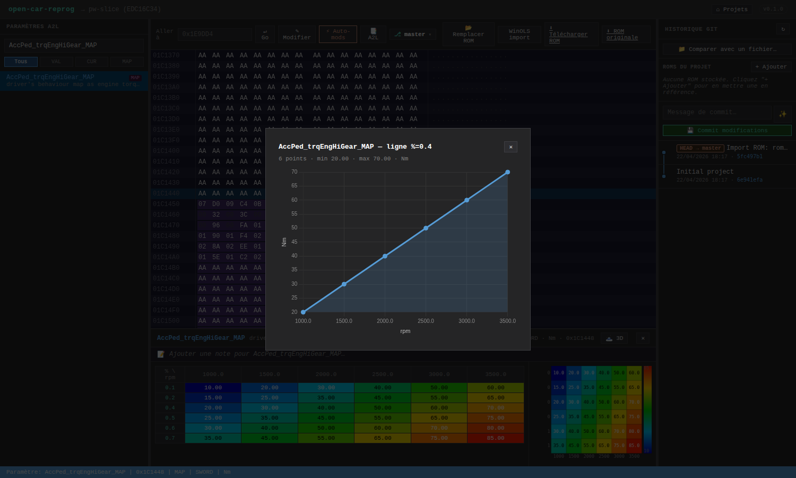
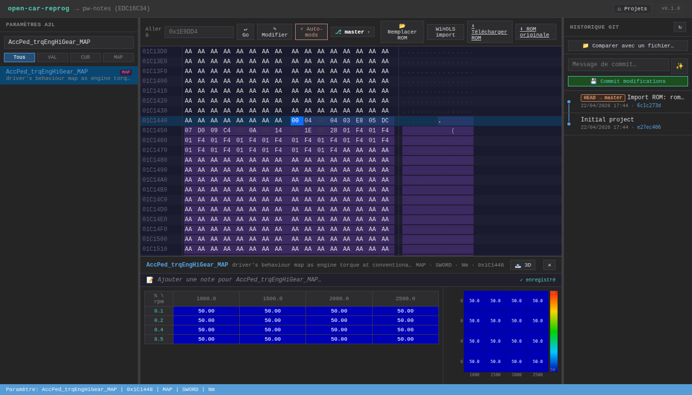

# Éditeur de cartographies

Quand tu cliques un paramètre A2L dans la sidebar gauche, l'éditeur de maps s'ouvre en bas. Il supporte 4 types A2L :

- **VALUE** — une seule valeur scalaire
- **CURVE** — tableau 1D (axe X + valeurs)
- **VAL_BLK** — bloc de valeurs sans axe
- **MAP** — tableau 2D (axe X + axe Y + grille)

## Toolbar

- **Nom + description** de la carte
- Métadonnées : `MAP · SWORD · Nm · 0x1C1448` (type · dataType · unité · adresse). L'unité affichée
  suit le toggle global Nm↔lb·ft / °C↔°F (bouton **`Nm · °C`** dans la toolbar principale) : si
  tu bascules en `lb·ft · °F`, ce header et les valeurs des cellules se convertissent à l'affichage,
  mais la ROM reste stockée dans l'unité A2L originale.
- Bouton **`🗻 3D`** / **`▦ 2D`** pour basculer la vue, bouton **`⟳`** pour remettre la rotation à zéro
- Bouton **`Δ vs parent`** (visible sans compareRom chargée) — charge en 1 clic le commit parent de
  HEAD comme référence et bascule en 3D mode delta automatiquement
- **✕** ferme l'éditeur

## Table éditable

Les cellules affichent les **valeurs physiques** (converties via les coefficients A2L — factor, offset, unité). Exemple : une valeur brute `500` SWORD peut afficher `50.00 Nm` avec un factor 0.1.

**Édition** :
- Double-click → entrée de valeur physique
- Validation (Enter / blur) → conversion automatique en raw via les coefficients

## Sélection multi-cellules

- **Click-drag** → sélection rectangulaire
- **Shift+click** → étend la sélection
- **Ctrl+click** → ajoute/retire une cellule

Une barre d'édition apparaît quand au moins une cellule est sélectionnée :

- Boutons rapides : `+1%` / `-1%` / `+5%` / `-5%` / `+10%` / `-10%`. Le **raw bouge toujours d'au
  moins 1 unité par cellule non-zéro** : un `+5%` sur une cellule à phys=1.0 (raw=10) donne
  raw=11 si l'arrondi naturel y mène, sinon il est forcé. Les cellules à 0 restent à 0 (l'intention
  du tuner n'est pas d'activer des zones éteintes). Si toutes les cellules sélectionnées sont à
  0 (padding firmware mismatch), un message apparaît sous la barre : *« ⚠ Toutes les cellules
  sélectionnées sont à 0 — aucun effet »*. Si seule une partie l'est : *« N modifiées, M à 0 ignorées »*.
- Input `Valeur…` + bouton `Appliquer` → valeur absolue
- `Tout sélectionner` / `Désélectionner`
- **`Copier` / `Coller`** (ou `Ctrl+C` / `Ctrl+V`) — copie le bloc de cellules sélectionnées et le colle à partir de la cellule active. Utile pour dupliquer une zone « safe » vers une autre région de la même map.
- **`Lisser`** — applique un filtre moyen 3×3 sur la sélection (supprime les pics / trous)
- **`Égaliser`** — remplace toutes les cellules par la moyenne de la sélection (mesa plate)
- **`Rampe`** — interpole linéairement entre les valeurs des 2 coins opposés de la sélection (gradient diagonal)

Les changements mettent à jour les octets en mémoire et sont répercutés dans l'hex editor (les octets deviennent orange). Appuyer `Ctrl+S` pour persister sur disque.

## Undo / redo ROM-level

Toute modification d'octets (édition manuelle, ±%, auto-mods, copier/coller, lisser/égaliser/rampe) est poussée sur une **pile undo au niveau du projet** :

- `Ctrl+Z` — annule la dernière modif (hex comme map)
- `Ctrl+Shift+Z` — refait la modif annulée

La pile est vidée quand tu fais un commit git (puisque git prend le relais comme historique canonique) ou que tu switches de projet.

## Heatmap

À droite de la table, un canvas Chart.js montre la cartographie en 2D heatmap :
- Axes X et Y avec unités
- Couleur interpolée (bleu → vert → jaune → rouge)
- Click cellule → sélectionne aussi dans la table

## Vue 3D surface

Le bouton **`🗻 3D`** bascule la heatmap en **surface 3D** :
- Les valeurs deviennent une élévation Z
- Palette identique (bleu bas → rouge haut)
- **Souris** = rotation interactive (drag = yaw + pitch)
- **Bouton `⟳`** = reset rotation

Utile pour visualiser d'un coup d'œil les creux (EGR fade-out, clamp de couple) et les pics (sur-injection). Repasser en 2D avec le même bouton (`▦ 2D`).

### 4 modes 3D (cyclables dès qu'une compareRom est chargée)

Click répété sur le bouton de mode → cycle **valeur → delta → split → overlay → valeur** :

- **🎨 Valeur** (défaut) — hauteur + couleur = valeur actuelle absolue (comme avant).
- **Δ Delta** — hauteurs = `(actuel − compareRom)`, couleurs divergentes
  (rouge = diminution, gris = inchangé, vert = augmentation). Une surface
  plate à zéro signifie qu'il n'y a rien changé dans ce quad. Idéal pour voir
  d'un coup d'œil quelle zone a été touchée par un tune.

  

- **⇄ Split** — 2 surfaces côte à côte (compareRom gauche, actuel droit) avec
  rotations synchronisées et échelle Z partagée pour comparer les formes.
- **▚ Overlay** — les 2 surfaces dans la même box 3D : l'actuelle remplie en
  heatmap, la référence en **wireframe blanc**. Là où le wireframe « décolle »
  de la surface colorée, c'est que la calibration a bougé à cet endroit.

  

### Charger une compareRom sans passer par le panel git

Le bouton **`Δ vs parent`** dans la toolbar (visible uniquement quand aucune
compareRom n'est encore chargée) charge le commit parent de HEAD comme
référence en 1 clic et bascule immédiatement en 3D mode delta. Pratique
juste après un commit pour voir ce qu'on vient de changer.

## Slice viewer

**Click sur un header de ligne ou de colonne** → ouvre un graphique Chart.js linéaire de cette tranche :

- Click numéro de **ligne** → courbe des valeurs en fonction de l'axe X (RPM, charge…) pour cette valeur d'axe Y
- Click numéro de **colonne** → courbe en fonction de l'axe Y

Ça permet de vérifier la monotonicité / le smoothing d'une slice sans quitter l'éditeur. Si tu modifies la map ensuite, le graphique se met à jour en temps réel.

## Notes de map

Chaque carte a une **note texte persistante par projet**, pour garder la trace des intentions :

- Icône 📝 dans la toolbar de l'éditeur
- Textarea libre (markdown simple accepté, pas de rendu)
- Sauvegarde auto en debounce (500 ms après la dernière frappe)
- Stockée dans `projects/<uuid>/notes.json` → `{ [mapName]: text }`
- Survit aux restores, branches, et updates d'A2L

Exemple d'usage : `"Stage 1 safe — baissé de 15% → 10% pour compatibilité embrayage usé"`.

## Layouts supportés

L'éditeur respecte le `RECORD_LAYOUT` A2L de chaque caractéristique :

- **Kf_Xs16_Ys16_Ws16** — layout classique EDC16C34 avec `NO_AXIS_PTS_X/Y` inline (header 4 bytes : nx, ny)
- **Kl_Xs16_Ws16** — CURVE 1D avec `NO_AXIS_PTS_X` inline (header 2 bytes)
- **Kwb_Wr32** — VAL_BLK 32-bit, dimensions fixes via `AXIS_DESCR.maxAxisPoints`
- **COM_AXIS** — axes partagés stockés séparément via `AXIS_PTS_REF`

Si un ROM ne contient pas la map à l'adresse A2L attendue (firmware différent, base offset), l'éditeur affiche un badge **`⚠ Layout`** dans la toolbar. Il tombe back sur les dimensions déclarées dans A2L (`maxAxisPoints`) pour pouvoir quand même rendre quelque chose.

## Compare view

Quand tu ouvres une carte depuis la liste du diff git, l'éditeur entre en **mode comparaison** vs le commit parent :

- Cellules **entourées de vert** = valeur augmentée depuis le commit parent
- Cellules **entourées de rouge** = valeur diminuée
- Hover → tooltip `avant: 50.00 → actuel: 70.00 (+20.00)`
- Banner en haut à droite : `📊 Comparaison vs "<commit>"` avec bouton `✕` pour quitter

Voir [Workflow git — Compare view](Workflow-git#compare-view).

## Unités d'affichage — Nm ↔ lb·ft / °C ↔ °F

Bouton **`Nm · °C`** dans la toolbar principale du projet. Click → bascule en
`lb·ft · °F` et tout l'affichage des cellules torque/temp se convertit
instantanément. Les écritures sur ROM continuent en unité A2L originale (ex :
taper `100` en mode lb·ft stocke `135.58 Nm`). La préférence est persistée par
projet dans `meta.json` (champ `units: { torque, temp }`).

Utilisé notamment pour travailler sur des tunes avec des unités imposées par
le client (compétition US, prep cliente custom).

## Raccourcis

| Action | Méthode |
|--------|---------|
| Entrer une valeur | Double-click cellule, taper, Enter (la valeur est interprétée dans l'unité courante) |
| Sélection rectangle | Click-drag |
| Ajuster sélection | `+5%`, `-5%`, etc. dans la barre (raw bump garanti) |
| Copier / coller sélection | `Ctrl+C` / `Ctrl+V` |
| Undo / redo modifs ROM | `Ctrl+Z` / `Ctrl+Shift+Z` |
| Bascule 2D ↔ 3D | Bouton **`🗻 3D`** / **`▦ 2D`** dans la toolbar heatmap |
| Cycle mode 3D (value / delta / split / overlay) | Bouton mode de la toolbar (visible si compareRom chargée) |
| Δ vs commit parent | Bouton `Δ vs parent` dans la toolbar |
| Toggle unités (Nm / lb·ft, °C / °F) | Bouton **`Nm · °C`** dans la toolbar du projet |
| Slice viewer | Click sur un header de ligne ou colonne |
| Notes map | Icône 📝 dans la toolbar de l'éditeur |
| Fermer | **✕** (toolbar) |
| Quitter compare mode | **✕** du banner |
