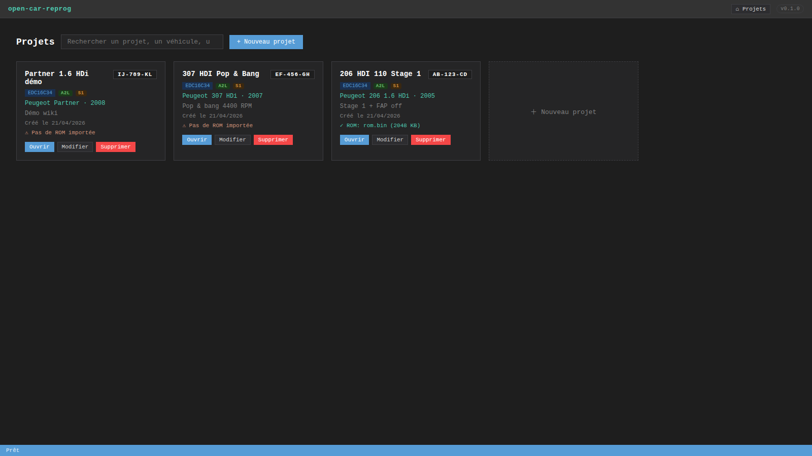
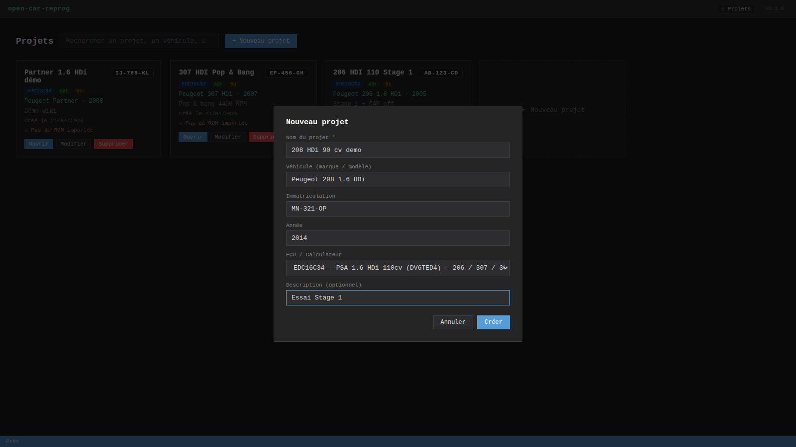

# Gestion des projets



## Page d'accueil

La grille affiche tous les projets, les plus récents en premier. Chaque carte montre :

- **Nom du projet** + **badge immatriculation**
- **Badges capacités** : l'ECU + `A2L` (paramètres disponibles) + `S1` (Stage 1 supporté)
- **Véhicule · année**
- **Description**
- **Date de création**
- **Statut ROM** : `✓ ROM: rom.bin (2048 KB)` si importée, sinon `⚠ Pas de ROM importée`
- Actions : **Ouvrir**, **Modifier**, **Supprimer**

## Recherche

La barre `Rechercher un projet, un véhicule, une immat…` filtre en temps réel sur :
- Nom du projet
- Nom du véhicule
- Immatriculation (insensible à la casse et aux tirets)
- Description
- Année

## Créer un projet

Bouton **`+ Nouveau projet`** :



Champs :
- **Nom** (obligatoire)
- **Véhicule** — marque / modèle (ex: Peugeot 206 1.6 HDi 110cv)
- **Immatriculation** — auto-formatée en MAJUSCULES
- **Année**
- **Calculateur** (obligatoire) — liste déroulante des 13 ECUs du catalog
- **Description**

## Modifier un projet

Bouton **`Modifier`** sur une carte, ou **`✎ Modifier`** dans la toolbar du workspace :


Mêmes champs que la création, plus :
- **Base adresses affichage (hex)** — voir [Éditeur Hex](Editeur-Hex#base-dadresses-configurable)

> 💡 Changer l'ECU d'un projet existant peut invalider les adresses A2L si tu passes sur un calculateur différent.

## Supprimer

Le bouton **`Supprimer`** efface **le dossier entier du projet** (ROM, backup, historique git). **Opération irréversible.**

## Organisation sur disque

```
projects/
  <uuid>/
    meta.json           # toutes les infos du projet
    rom.bin             # ROM en cours d'édition
    rom.original.bin    # backup immuable (jamais écrasé)
    .git/               # repo git du projet
```

Tu peux zipper `projects/<uuid>/` pour déplacer un projet d'une machine à une autre. Pour importer côté nouvelle machine, recrée le dossier et relance le serveur — les projets sont auto-détectés au prochain chargement.
