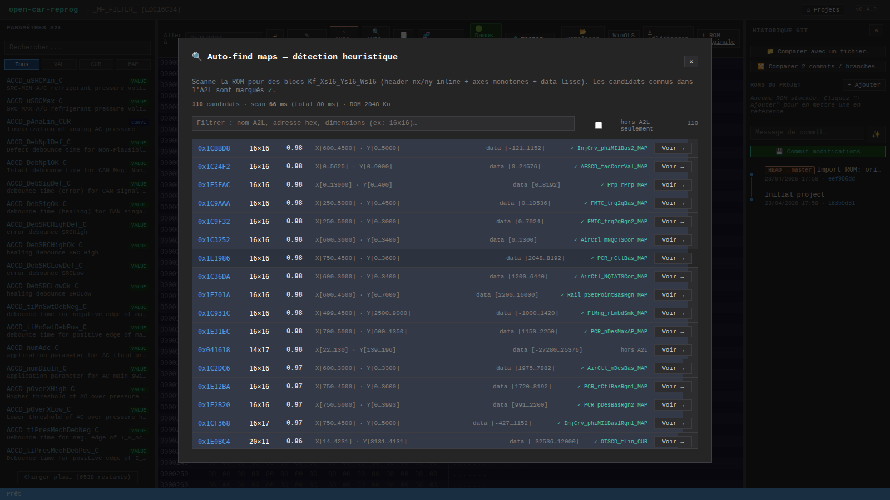

# Map-Finder


Le **Map-Finder** détecte automatiquement les MAPs dans une ROM en scannant le binaire à la recherche du layout Bosch `Kf_Xs16_Ys16_Ws16` (ou équivalent avec header `nx, ny` inline). **Cas d'usage principal** : ROMs sans fichier A2L, ou A2L partiel où seulement une fraction des maps est déclarée.

## Lancer un scan

Toolbar → bouton **`🔎 Trouver maps`**. Le serveur scanne la ROM (~30 ms pour 2 Mo sur un Bosch réel) et retourne les candidats triés par score.

La modal liste chaque candidat avec :
- **Adresse** hex
- **Dimensions** `nx × ny`
- **Score** (0..1, barre colorée)
- **Range data** (min → max raw)
- **Nom A2L connu** si l'adresse correspond à une caractéristique de l'A2L du projet (cross-référence automatique)

Click sur **`Voir →`** sur un candidat → l'hex editor saute à l'adresse et met la région en surbrillance.

### Filtrer la liste (v0.5.0+)

Sur un Bosch plein, le scan renvoie souvent 100+ candidats. La barre au-dessus de la liste permet
de réduire :

- **Input de filtre** — matche par :
  - *nom A2L connu* (ex: `AccPed`)
  - *substring d'adresse hex* (ex: `1c1`, `0x1c1`)
  - *dimensions* (ex: `16x16`, `16×16`)
- **Toggle « hors A2L seulement »** — ne montre que les candidats qui ne correspondent à
  **aucune** caractéristique de l'A2L projet. C'est là qu'un tuner trouve les vraies MAPs
  non documentées à explorer.
- Compteur `N/total` à droite pour voir l'impact du filtre.



## Comment ça marche

À chaque **offset pair**, le scanner interprète `(nx, ny)` comme UWORD big-endian. Si les deux sont dans la fenêtre `[minN, maxN]` (défaut `4..32`), il lit les axes à l'offset attendu :

```
A+0              : nx (UWORD BE)
A+2              : ny (UWORD BE)
A+4              : axe X [nx × SWORD]
A+4+nx*2         : axe Y [ny × SWORD]
A+4+(nx+ny)*2    : données [nx × ny × SWORD]
```

### Filtres (tous obligatoires)

- `nx`, `ny` dans `[minN, maxN]`
- Axes **strictement monotones** (croissants ou décroissants)
- Span axe ≥ 10 (exclut les axes constants)
- Range data ≥ 5 (exclut zones `0xFF` / `0x00` / padding)

### Score (0..1)

```
score = 0.55 × smoothness + 0.25 × variance + 0.20 × taille préférée
```

- **smoothness** = `1 − moyenne(|diff adjacents|) / range total` — pénalise les grilles qui sautent d'une cellule à l'autre
- **variance** = `min(1, range / 1000)` — pénalise les grilles trop plates
- **taille** = pic à `nx + ny = 32` (16×16, le plus fréquent), décroit linéairement ±40

### Déduplication

Les candidats dont les adresses se chevauchent à ±16 octets près sont fusionnés — on garde celui avec le plus haut score.

## Limites

Le finder détecte **uniquement** les layouts avec `(nx, ny)` inline en UWORD BE au début du bloc. Il ne voit pas :

- Les layouts où `nx` / `ny` sont **fixés dans le RECORD_LAYOUT A2L** sans header (`MaxAxisPoints` statique) — c'est le cas des 5 MAPs Stage 1 EDC16C34, qui sont toutes des 16×16 déclarées dans le damos.
- Les COM_AXIS (axes stockés séparément, référencés via `AXIS_PTS_REF`).
- Les CURVE 1D.

C'est cohérent avec l'objectif : le finder est utile pour **les ROMs sans A2L** ou **les ECUs où l'A2L est partiel**. Sur un projet EDC16C34 avec le damos complet, tu trouveras plutôt tes maps via le panneau [Paramètres A2L](Parametres-A2L).

## API REST

| Méthode | Route | Description |
|---------|-------|-------------|
| GET | `/api/projects/:id/auto-find-maps` | Scan heuristique, retourne les candidats triés par score (`knownName` ajouté si match A2L) |

Paramètres optionnels :
- `minN` / `maxN` — bornes pour `nx` / `ny` (défaut 4 / 32)

## Code source

Algo : `src/map-finder.js`. La route serveur dans `server.js` fait le cross-ref A2L en postprocessing.
