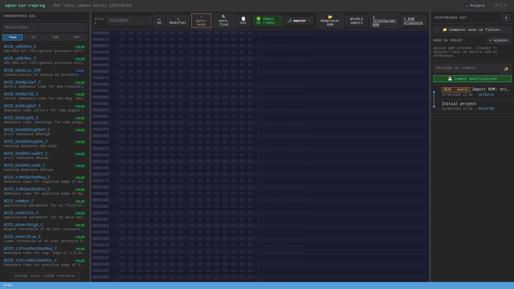
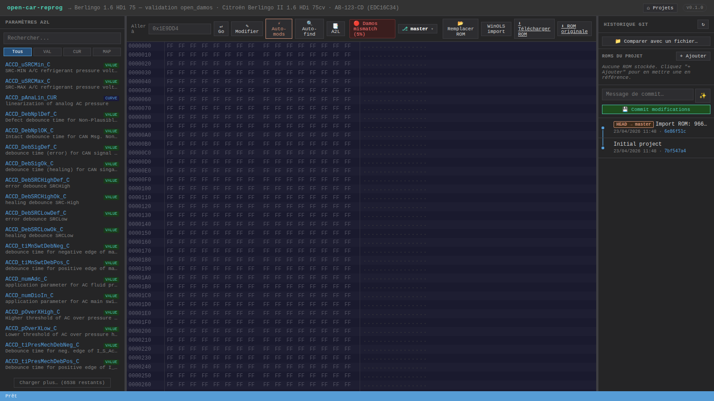

# open_damos — damos libre et gratuit par empreinte d'axes

**open_damos** est un damos alternatif open-source pour les ECU supportés, qui remplace la nécessité d'acheter un fichier damos Bosch propriétaire (typiquement 50 € à 200 € par version firmware chez les vendeurs spécialisés).

L'astuce : au lieu de hardcoder les adresses — qui changent entre firmwares — on décrit chaque cartographie par l'**empreinte de ses axes** (RPM, pression, pédale…). L'outil scanne ta ROM et retrouve automatiquement chaque map en cherchant ses axes. Ça marche **sans damos dédié** pour ton firmware, sur n'importe quelle variante de la même famille d'ECU.

Licence : **CC0-1.0** (domaine public). Contribue à ton tour — cross-check confirmé = PR bienvenue.

---

## Pourquoi c'est nécessaire

Un damos Bosch (`damos.a2l`) est une licence de calibration PRIVÉE générée pour UNE version firmware précise. Les adresses sont absolues : `AccPed_trqEngHiGear_MAP = 0x1C1448`. Quand Bosch release un firmware update (recall, bug fix), il réorganise la table et toutes les adresses bougent. Ton vieux damos ne matche plus.

Résultat : chaque tuner qui touche un EDC16C34 PSA doit soit acheter le damos correspondant à SON firmware (qu'il faut identifier à la main par le part number), soit reverser les adresses au hex editor. open_damos contourne ça : les axes ne changent pas ou très peu entre firmwares de la même famille, donc les **chercher par fingerprint** est fiable.

---

## Fichier `open_damos.json`

Vit dans `ressources/<ecu>/open_damos.json`. Schéma (extrait) :

```json
{
  "ecu": "edc16c34",
  "version": "1.0.0",
  "license": "CC0-1.0",
  "characteristics": [
    {
      "name": "AccPed_trqEngHiGear_MAP",
      "category": "stage1",
      "type": "MAP",
      "defaultAddress": "0x1C1448",
      "dims": { "nx": 16, "ny": 10 },
      "axes": [
        {
          "inputQuantity": "Eng_nAvrg",
          "unit": "rpm",
          "fingerprint": [400, 650, 750, 1000, 1250, 1500, 1750, 2000,
                           2250, 2500, 2750, 3000, 3500, 4000, 5000, 5300]
        },
        {
          "inputQuantity": "AccPed_rChkdVal",
          "unit": "%",
          "fingerprint": [90, 1229, 2212, 2849, 3195, 3932, 4751, 5734, 6554, 8192]
        }
      ],
      "data": { "factor": 0.1, "offset": 0, "unit": "Nm" },
      "stage1": { "defaultPct": 15, "safePct": 10, "sportPct": 18 }
    }
  ]
}
```

Chaque entry porte :
- **defaultAddress** : l'adresse du damos.a2l de référence (pour ori.BIN)
- **axes.fingerprint** : les valeurs d'axes telles que lues dans ori.BIN — l'empreinte à chercher
- **recommendations Stage 1** : safe/default/sport ready à appliquer

---

## Algorithme de relocalisation

Le code vit dans `src/open-damos.js` (~220 lignes). Pour chaque MAP/CURVE :

1. **Scan offset pair** de la ROM (2 Mo = 1 M d'offsets possibles, ~100-250 ms)
2. À chaque offset, vérifie si l'en-tête `(nx, ny)` UWORD BE matche les dimensions attendues
3. Si oui, lit les axes et compare via un matcher **à deux passes** :
   - **Strict** : chaque valeur de l'axe lu doit être dans `max(100, 5% × fingerprint[i])` de la valeur attendue. Si ≥ 85 % des valeurs matchent → match confirmé, score `strict`.
   - **Bag-of-values** (fallback) : combien de valeurs du fingerprint existent _quelque part_ dans l'axe lu (à tolérance). Si ≥ 70 % + min/max cohérents → match, score `bag` (plus bas, ~0.8×).
4. Score = (xAxis + yAxis) / 2, bonus +0.1 si les 2 axes sont en mode strict

**Désambiguation** (quand 2 maps ont des fingerprints similaires) : attribution greedy par ordre d'apparition dans le damos, chacune prend le candidat non-pris le plus proche de son `defaultAddress`. Résout proprement les cas comme "driver's wish Hi/Lo gear" qui partagent les mêmes axes sur les variantes PSA 75cv.

**Relocalisation des VALUE** : via ancrage sur une MAP. Si `AccPed_trqEngLoGear_MAP` a été relocalisée à +1064 octets, on applique le même delta à `AirCtl_nOvrRun_C` (qui vit dans la même région mémoire chez Bosch). Avec sanity check post-ancrage : la valeur lue doit rester dans une plage physique cohérente.

---

## Badge Damos-match dans l'UI

Quand tu importes une ROM, l'app fetch `GET /api/projects/:id/a2l/match` et affiche un badge dans la toolbar :

| Badge | Score | Signification |
|-------|-------|---------------|
| **🟢 Damos OK** | ≥ 90 % | Le damos correspond à ta ROM — Stage 1 utilise les adresses A2L directement |
| **🟠 Damos partiel** | 30-89 % | Firmware cousin — chaque map A2L est vérifiée, fallback open_damos si échec |
| **🔴 Damos mismatch** | < 30 % | Le damos est pour un autre firmware — open_damos prend le relais via fingerprint |



*Badge vert 100 % sur ori.BIN (firmware de référence du damos).*



*Badge rouge 5 % sur un Berlingo 1.6 HDi 75cv (SW Bosch `1037383736`) — damos.a2l est pour un firmware différent. open_damos prend le relais automatiquement.*

Click sur le badge → modal avec détails (combien d'entries valident, source damos custom/catalog, recommandations). Aucune action requise : la cascade d'adresses gère le mismatch.

---

## Intégration dans l'app

Cascade d'adresses dans `/api/projects/:id/stage1` (et endpoints dérivés) :

| # | Source | Quand utilisé |
|---|--------|---------------|
| 1 | A2L custom du projet (📑 A2L upload) | L'utilisateur a uploadé SON damos → source de vérité |
| 2 | A2L catalog (damos.a2l livré) | Si pas de custom et si la ROM matche la référence ori.BIN |
| 3 | **open_damos fingerprint** | Si A2L échoue (ROM firmware différent) → scan automatique |
| 4 | catalog ecu-catalog.js | Dernier recours (hardcoded, dev fallback) |

Chaque résultat précise `addressSource` : `a2l` / `open_damos:fingerprint` / `open_damos:fingerprint (a2l-fallback)` / `catalog`. Le frontend peut afficher un badge « 🎯 auto-relocated » pour expliquer à l'utilisateur.

---

## État actuel

### `ressources/edc16c34/open_damos.json` (v1.1.0 — 20 entries)

| Catégorie | Entries | Statut |
|-----------|---------|--------|
| Stage 1 — couple/fuel/rail/timing | 6 MAPs + 1 MAP propulsion | ✅ Tous fingerprints validés sur ori.BIN et Berlingo 75cv |
| Safety — limiters | 1 MAP + 1 CURVE + 1 VALUE | ✅ Rail max, EngPrt_qLim, AccPed_trqNMRMax |
| Smoke / combustion | 1 MAP (FlMng_rLmbdSmk) + 1 MAP timing | ✅ clé pour Stage 1 diesel |
| Air / flow | 2 MAPs + 1 CURVE | ✅ AFSCD correction / substitute / linearisation |
| Fuel / driver | 1 CURVE fuel density + 1 MAP inverse | ✅ |
| Popbang — overrun | 2 VALUEs | ⚠ ancrage sur LoGear, sanity-checked |
| EGR + non-monitored | 2 VALUEs | ⚠ ancrage, vérifier manuellement avant patch |

## Export A2L ASAP2 (utilisable dans WinOLS, TunerPro, EcuFlash)

open_damos peut être exporté en format **A2L ASAP2 standard** — la même spec qu'utilisent les damos commerciaux :

| Route | Description |
|-------|-------------|
| `GET /api/ecu/edc16c34/open-damos.a2l` | **Baseline A2L** (adresses du damos de référence ori.BIN) |
| `GET /api/projects/:id/open-damos.a2l` | **A2L relocalisé pour TA ROM** — les fingerprints ont résolu les vraies adresses de ton firmware |
| `GET /api/projects/:id/open-damos.json` | JSON structuré avec la relocation complète (adresses, scores, matchMode) |

Les headers HTTP `X-Open-Damos-Fingerprint` / `X-Open-Damos-Anchor` / `X-Open-Damos-Total` indiquent combien d'entries ont été relocalisées par fingerprint (fiable) vs anchor (approximatif).

Dans l'UI : bouton **🧬 open_damos** dans la toolbar (à côté de 📑 A2L) — click pour télécharger l'A2L relocalisé du projet courant. À utiliser :
- Dans **WinOLS** : `File → Read assignment file` avec le .a2l téléchargé → les 20 maps s'affichent avec leurs axes et unités
- Dans **open-car-reprog** : re-upload via `📑 A2L` pour que les paramètres A2L à gauche soient propres
- Dans **TunerPro / EcuFlash** : supporté par le format ASAP2 standard

**Compatibilité** : toute la famille **Bosch EDC16C34 PSA DV6TED4** (1.6 HDi 75/90/110 cv) — Citroën Berlingo / C3 / C4, Peugeot 206 / 207 / 307 / 308 / 407 / Partner, Ford Fiesta TDCi, Mazda 2 / 3 MZ-CD. Testé end-to-end sur `ori.BIN` (firmware de référence) et `9663944680.Bin` (Berlingo II 1.6 HDi 75cv, SW Bosch `1037383736`).

### Tests automatisés

- `tests/open-damos.test.js` — vérifie les 5 Stage 1 MAPs relocalisées sur les 2 ROMs + test négatif sur ROM aléatoire (pas de faux positif)
- `tests/ecu-catalog-edc16c34.test.js` — garde-fou catalog addresses sur ori.BIN

Lancer : `node tests/open-damos.test.js` (pas besoin du serveur).

---

## Étendre open_damos à un autre ECU

1. Obtenir une ROM de référence et le damos.a2l correspondant (si trouvable) OU une ROM tunée connue pour cross-check
2. Créer `ressources/<ecu>/open_damos.json`
3. Pour chaque carte à inclure : lire ses axes dans la ROM de référence, coller les valeurs dans `fingerprint`
4. `defaultAddress` = adresse du damos de référence
5. Tester sur au moins 2 firmwares différents de la même famille
6. PR bienvenue

---

## Limites connues

1. **Les VALUEs scalaires** sont ancrées sur une MAP voisine — fonctionne mais moins fiable que le fingerprinting d'axes. Si l'ancrage donne une valeur aberrante, le serveur retombe sur `default-fallback` avec warning. **Vérifier manuellement** avant de flasher des valeurs relocalisées par ancrage (EGR OFF, popbang…).

2. **Les MAPs à layout fixe sans header inline** (certaines cartes EDC17 / MED17 qui n'ont pas `NO_AXIS_PTS_X/Y` dans leur RECORD_LAYOUT) ne sont pas détectables par cette approche. Le workaround : utiliser les adresses du damos A2L avec offset calculé via une MAP-ancre.

3. **Les firmwares très divergents** (nouvelle génération, grosse refonte calibration) peuvent avoir des axes redessinés qui ne matchent plus du tout. Dans ce cas, il faut ajouter une variante fingerprint dans open_damos.json ou uploader un damos custom.

---

## Voir aussi

- [Tuto Stage 1 (avec/sans damos)](Tuto-Stage1) — workflow pas-à-pas
- [Map-Finder](Map-Finder) — détection heuristique (complémentaire pour maps pas dans open_damos)
- [Paramètres A2L — custom par projet](Parametres-A2L#a2l-personnalisé-par-projet) — si tu trouves un damos spécifique à ton firmware
- [API REST — /stage1 cascade](API-REST#modifications-automatiques)
