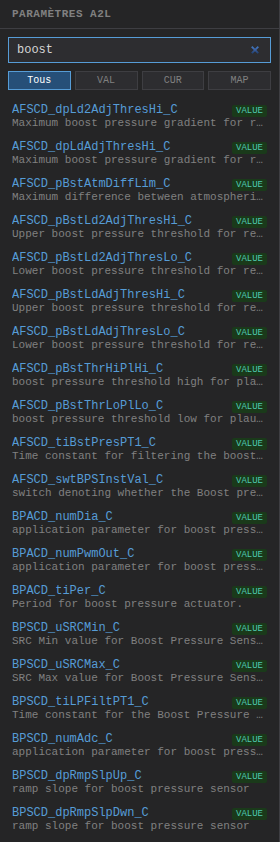
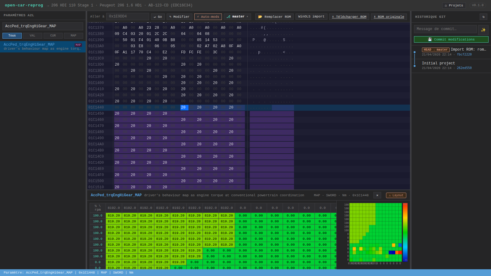

# Paramètres A2L



La sidebar gauche liste les **6 638 caractéristiques** du fichier DAMOS (A2L) Bosch EDC16C34 :
- ~5000 **VALUE** (scalaires)
- ~900 **CURVE** (tables 1D)
- ~600 **MAP** (tables 2D)
- ~100 **VAL_BLK** (blocs de valeurs)

## Recherche

Le champ `Rechercher…` filtre en temps réel sur :
- Le **nom** du paramètre (`Rail_pSetPointBase_MAP`, `AirCtl_nOvrRun_C`…)
- Sa **description** (`SRC-MIN A/C refrigerant pressure voltage`, `Higher threshold…`)

Insensible à la casse. Les caractéristiques matchent si la query apparaît n'importe où dans le nom ou la description.

**Tips recherche** :
- `boost` → toutes les maps liées au boost
- `EGR` → circuit EGR
- `Rail_p` → pressions rail
- `FAP` / `DPF` → filtre à particules
- `_MAP` → toutes les maps 2D uniquement

## Filtre par type

Onglets **Tous / VAL / CUR / MAP** au-dessus de la liste.

Actuellement la catégorie `VAL_BLK` est incluse dans `VAL`.

## Scroll infini

Les 6638 caractéristiques ne sont pas toutes rendues d'un coup. Par défaut 200 éléments chargés, bouton **`Charger plus… (N restants)`** en bas pour charger les suivants. Tu peux aussi continuer à scroller — la recherche réinitialise le compteur.

## Sélection d'un paramètre

Click sur une ligne :
1. L'**hex editor** saute à l'adresse du paramètre
2. La zone correspondante est **surbrillée en violet** (approximation basée sur le type et les dimensions A2L)
3. L'**éditeur de cartographies** s'ouvre en bas avec la heatmap



La barre de statut affiche : `Paramètre: Rail_pSetPointBase_MAP | 0x17A4A4 | MAP | SWORD | bar`

## Fichier DAMOS

Le fichier source est `ressources/edc16c34/damos.a2l` (440 000 lignes, format ASAP2). Il est parsé au premier accès et caché en JSON dans `ressources/edc16c34/damos.cache.json` (3,1 Mo, gitignoré).

Pour forcer un re-parse : supprimer le cache et relancer le serveur.

```bash
rm ressources/edc16c34/damos.cache.json
node server.js
```

## Structure A2L exposée par l'API

Quand tu cliques un paramètre, l'app fait `GET /api/ecu/edc16c34/parameters/<name>` qui retourne :

```json
{
  "name": "AccPed_trqEngHiGear_MAP",
  "description": "driver's behaviour map as engine torque…",
  "type": "MAP",
  "address": 1840200,
  "recordLayout": "Kf_Xs16_Ys16_Ws16",
  "conversion": "Trq",
  "axisDefs": [
    { "attribute": "STD_AXIS", "inputQuantity": "Eng_nAvrg", "conversion": "EngN",
      "maxAxisPoints": 16, "lowerLimit": -32768, "upperLimit": 32767,
      "dataType": "SWORD", "byteSize": 2, "factor": 1, "offset": 0, "unit": "rpm" },
    { "attribute": "STD_AXIS", "inputQuantity": "AccPed_rChkdVal", "conversion": "Prc",
      "maxAxisPoints": 16, "dataType": "SWORD", "byteSize": 2,
      "factor": 0.0122, "offset": 0, "unit": "%" }
  ],
  "dataType": "SWORD",
  "byteSize": 2,
  "byteOrder": "BIG_ENDIAN",
  "unit": "Nm",
  "factor": 0.1,
  "offset": 0,
  "_recordLayout": { ... },
  "_compuMethod": { ... }
}
```

## Parser A2L — attention AXIS_DESCR

L'ordre ASAP2 des champs positionnels de `AXIS_DESCR` est :

```
AXIS_DESCR Attribute InputQuantity Conversion MaxAxisPoints LowerLimit UpperLimit
```

Un bug précoce du parser lisait des champs fantômes `recordLayout` et `maxDiff` qui n'existent pas en ASAP2 — résultat : toutes les maps affichaient `nx=32767` (qui est en fait l'UpperLimit). Corrigé dans commit `8d8f248`. Si tu pulles une version plus ancienne, supprime le cache pour forcer le re-parse.
