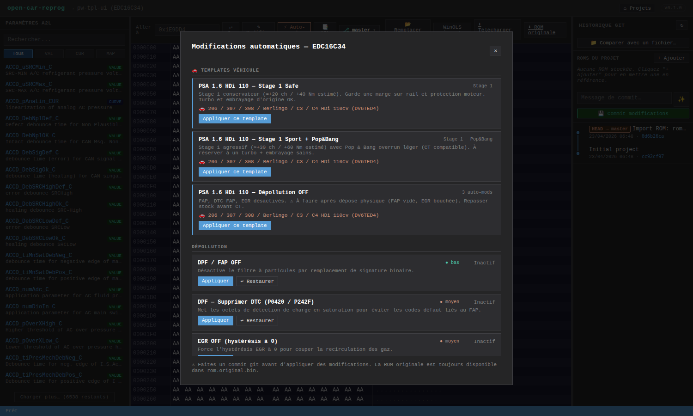

# Templates véhicule



Les **templates véhicule** sont des presets « one-click » qui bundlent en une seule application :

- un **Stage 1** (pourcentages par carte, réutilise les adresses de `ecu-catalog.stage1Maps`),
- optionnellement un **Pop & Bang** (RPM seuil + quantité carburant),
- optionnellement une liste d'**auto-mods** (DPF, EGR, DTC…).

Le but : éviter au tuner de cliquer 10 fois dans le modal Auto-mods pour une recette standard sur une famille de voiture connue.

## Où les trouver

Toolbar → **`⚡ Auto-mods`** → section **`🚗 Templates véhicule`** en haut de la modal. Seuls les templates **compatibles avec l'ECU du projet** sont affichés.

## Templates livrés

Pour EDC16C34 (PSA 1.6 HDi 110 cv — 206, 307, 308, Partner…) :

| Template | Stage 1 | Pop & Bang | Auto-mods |
|----------|---------|------------|-----------|
| **PSA 1.6 HDi 110 — Stage 1 Safe** | +10/10/8/5/20 % | ❌ | ❌ |
| **PSA 1.6 HDi 110 — Stage 1 Sport** | +15/15/12/10/25 % | 4400 rpm / 15 mg | ❌ |
| **PSA 1.6 HDi 110 — Dépollution OFF** | — | — | DPF + DTC DPF + EGR |

L'application est **atomique côté serveur** : le endpoint `POST /api/projects/:id/apply-template/:tid` charge le ROM, patche Stage 1, patche popbang, patche auto-mods, puis écrit le tout en un seul `fs.writeFile`. Si une étape échoue, aucun octet n'est modifié.

## Ajouter un template

Éditer `src/vehicle-templates.js` :

```js
module.exports = {
  VEHICLE_TEMPLATES: {
    psa_16hdi_110_stage1_safe: {
      id: 'psa_16hdi_110_stage1_safe',
      name: 'PSA 1.6 HDi 110 — Stage 1 Safe',
      description: 'Stage 1 prudent pour embrayage usé',
      appliesTo: ['edc16c34'],
      stage1: {
        pcts: {
          AccPed_trqEngHiGear_MAP: 10,
          AccPed_trqEngLoGear_MAP: 10,
          FMTC_trq2qBas_MAP: 8,
          Rail_pSetPointBase_MAP: 5,
          EngPrt_trqAPSLim_MAP: 20
        }
      }
      // popbang: { rpm: 4400, fuelQty: 15 },
      // autoMods: ['dpfOff', 'dpfDtc', 'egrOff']
    }
  }
};
```

Contraintes :
- `appliesTo` doit matcher un id d'ECU déclaré dans `src/ecu-catalog.js`
- Les clefs de `stage1.pcts` doivent exister dans `stage1Maps` de cet ECU
- Les ids d'`autoMods` doivent exister dans `autoModPatterns` / `autoModAddresses` de cet ECU

Pas besoin de toucher au frontend : la liste est servie par `GET /api/projects/:id/templates`.

## API REST

| Méthode | Route | Description |
|---------|-------|-------------|
| GET | `/api/templates` | Tous les templates, toutes ECUs |
| GET | `/api/projects/:id/templates` | Templates compatibles avec l'ECU du projet |
| POST | `/api/projects/:id/apply-template/:tid` | Applique un template — retourne `{ ok: true, commit: 'auto-applied…' }` |

Voir [API REST](API-REST).
