# Tuto — Créer un Stage 1 pas-à-pas (avec et sans damos)

> Tuto pratique sur un vrai cas : ROM stock d'un **Citroën Berlingo II 1.6 HDi 110 cv** (EDC16C34 Bosch, part number PSA `9663944680`). On va faire un Stage 1 deux fois :
> 1. **Avec le damos A2L** — workflow propre, 2 minutes.
> 2. **Sans damos** — approche reverse : map-finder + compare vs ROM tunée de référence.
>
> Internet est plein de tutos vagues ("change les cartes de couple / rail / injection +15%"). Celui-ci donne les adresses exactes, les axes, les unités, et surtout **comment valider ton travail avant de flasher**.

---

## Pré-requis

| | |
|---|---|
| **Véhicule** | Citroën Berlingo II 1.6 HDi 110 cv (DV6TED4) — et tous les PSA qui partagent l'EDC16C34 : 206, 307, 308, Partner, C3, C4 1.6 HDi 110 |
| **ECU** | Bosch EDC16C34, ROM 2 Mo, MPC555 |
| **ROM stock** | `9663944680.Bin` (part number Bosch PSA pour 1.6 HDi 110) — déjà dans `ressources/edc16c34/` du repo |
| **Outil de flash** | MPPS / KESS / Galletto / CMD Flash / bitbox — n'importe quel outil qui recalcule les checksums au flash (tous les modèles diesel récents le font) |
| **open-car-reprog** | Version courante (`node server.js`, http://localhost:3000) |

Les 5 cartographies modifiées par un Stage 1 classique sur EDC16C34 :

| Carte | Adresse | Rôle | Δ typique |
|-------|---------|------|-----------|
| `AccPed_trqEngHiGear_MAP` | `0x16D6C4` | Couple demandé par la pédale, rapports hauts (4e/5e) | **+15 %** |
| `AccPed_trqEngLoGear_MAP` | `0x16DA04` | Couple demandé par la pédale, rapports bas (1re/2e/3e) | **+15 %** |
| `FMTC_trq2qBas_MAP` | `0x1760A4` | Conversion couple demandé → quantité carburant injectée | **+12 %** |
| `Rail_pSetPointBase_MAP` | `0x17A4A4` | Pression rail cible (bar) | **+10 %** |
| `EngPrt_trqAPSLim_MAP` | `0x1758E4` | Limiteur de couple (protection moteur) | **+25 %** |

Les 3 premières augmentent la puissance, la 4e suit (il faut plus de pression rail pour injecter plus), la 5e relève le toit de protection pour ne pas clamper ton gain.

---

# Partie 1 — Avec damos (A2L EDC16C34)

Le A2L Bosch est chargé dans le repo (`ressources/edc16c34/damos.a2l`, 6638 caractéristiques). Rien à uploader — l'app le prend automatiquement.

## Étape 1 — Créer le projet

Sur la page d'accueil, clic **`+ Nouveau projet`** :

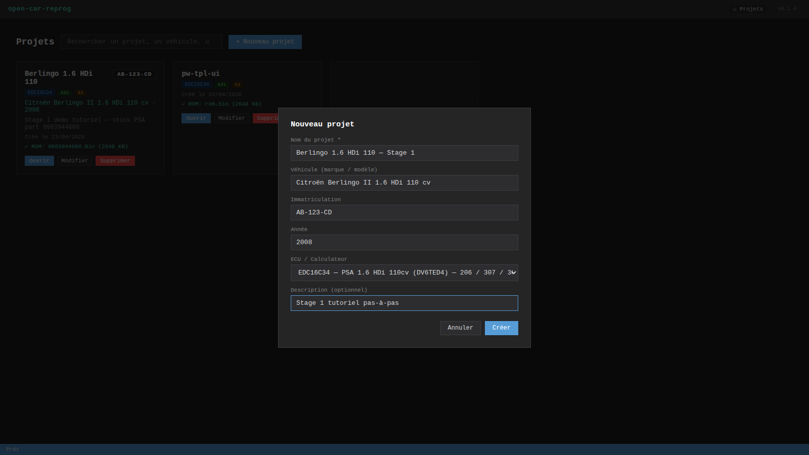

Champs remplis :
- **Nom** : `Berlingo 1.6 HDi 110 — Stage 1`
- **Véhicule** : `Citroën Berlingo II 1.6 HDi 110 cv`
- **Immatriculation** : `AB-123-CD`
- **Année** : `2008`
- **Calculateur** : `edc16c34` (obligatoire)
- **Description** : texte libre

Seuls **Nom** et **Calculateur** sont obligatoires. Clic **`Créer`**.

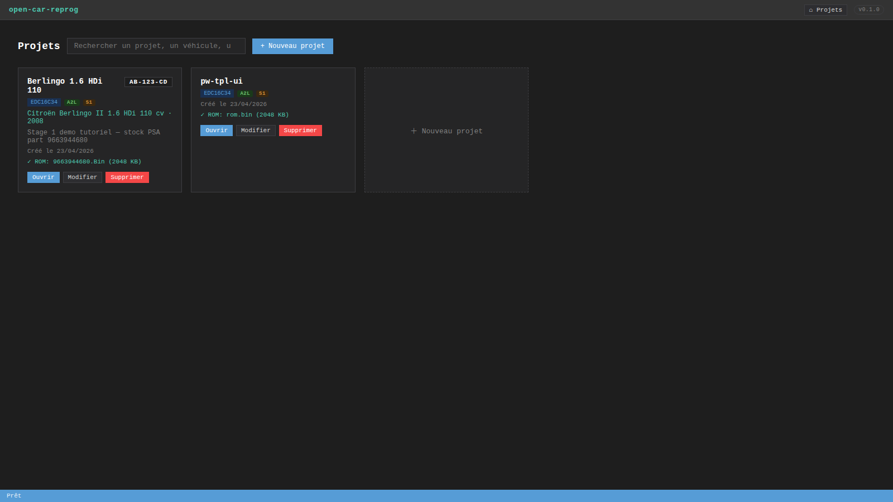

## Étape 2 — Importer la ROM stock

Clic sur la carte `Ouvrir`. La vue projet s'ouvre avec un placeholder au milieu. **Drag-and-drop** le fichier `9663944680.Bin` sur la zone, ou clic **`📂 Importer ROM`**.

Dès l'import :
- `rom.bin` créé (copie éditable) + `rom.original.bin` (backup immuable)
- Un premier commit git auto : `Import ROM: 9663944680.Bin`

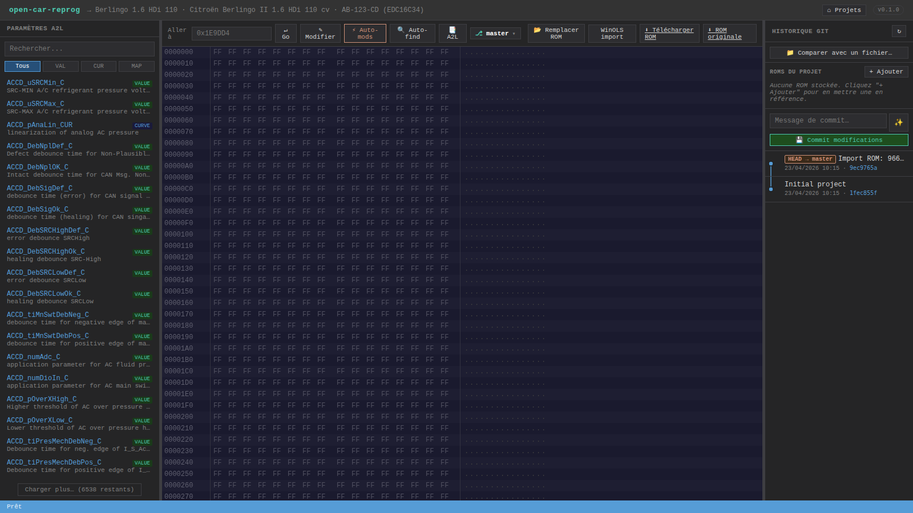

De gauche à droite : **paramètres A2L** (6638 caractéristiques), **hex editor** + **éditeur de maps** au centre, **panneau git** à droite.

## Étape 3 — Trouver la première carte Stage 1

Dans la sidebar gauche, tape `AccPed_trqEng` dans le champ recherche :

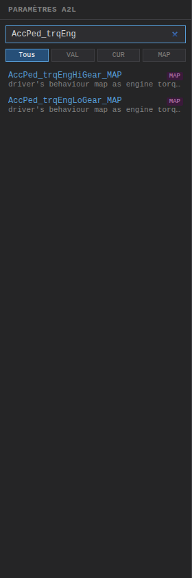

Deux résultats : `AccPed_trqEngHiGear_MAP` (haut rapport) et `AccPed_trqEngLoGear_MAP` (bas rapport). Clic sur **`AccPed_trqEngHiGear_MAP`**.

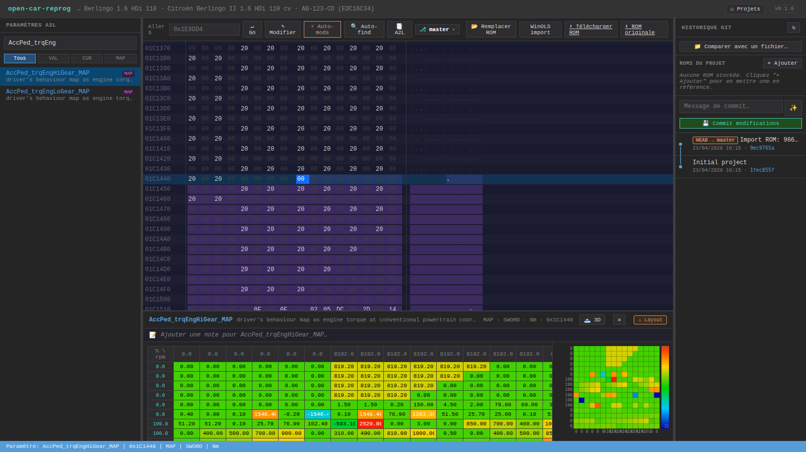

Trois choses se passent :
1. **Hex editor** saute à `0x16D6C4` et met la zone en surbrillance violette
2. **Éditeur de maps** s'ouvre en bas avec :
   - Table éditable 16×16 (cellules en Nm)
   - Heatmap à droite (bleu = faible couple, rouge = fort couple)
3. **Barre de statut** bas : `MAP · SWORD · Nm · 0x16D6C4`

Lis la métadonnée en haut de l'éditeur : **driver's behaviour map as engine torque as a function of rpm and pedal position**. Axes :
- **X** = `Eng_nAvrg` (régime moteur, rpm)
- **Y** = `AccPed_rChkdVal` (position pédale, %)
- **Z** (cellules) = couple demandé en Nm

À régime moyen / pédale moyenne tu vois typiquement ~150-200 Nm. À plein gaz tu tapes ~240-250 Nm : **c'est le plafond de couple demandé par le conducteur**. Stage 1 = relever ce plafond.

## Étape 4 — Comprendre avant de tripoter

Clic sur **la cellule en haut à droite** (max rpm × max pédale) → elle devient bleue, la barre de sélection apparaît en bas.

**Maintient `Ctrl` + clic** sur d'autres cellules de la zone pleine charge (ou drag pour une sélection rectangulaire). Clic **`Tout sélectionner`** pour voir l'intégralité de la map :

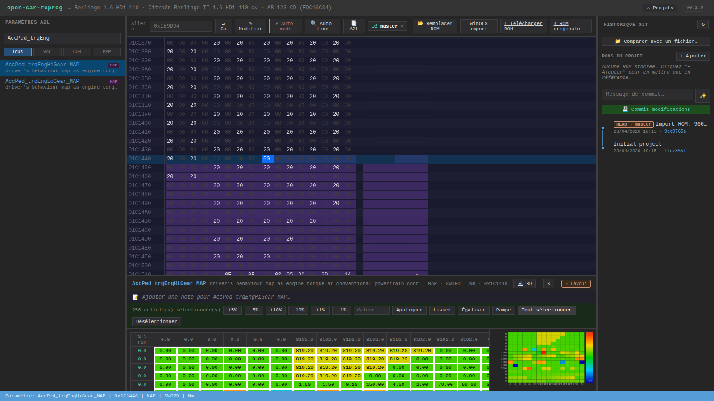

La barre indique `256 cellule(s) sélectionnée(s)` et tous les boutons `+5%`, `+10%`, etc. sont actifs.

## Étape 5 — Modif manuelle (pour comprendre)

Clic **`+10%`** — chaque cellule est multipliée par 1.10, clampée à `±32767`, ré-écrite en SWORD big-endian :

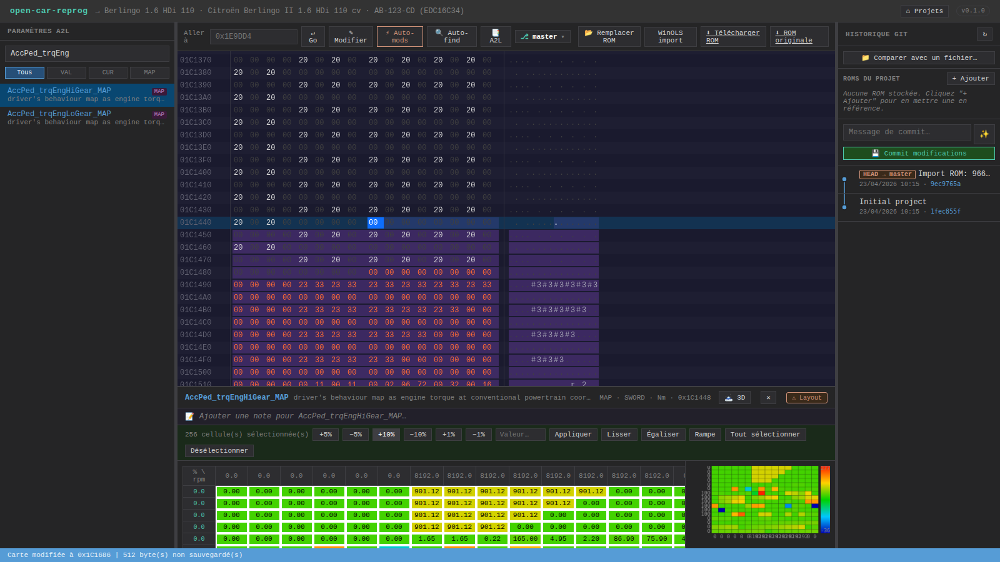

Les octets deviennent **orange** dans l'hex editor : modifs en RAM, pas encore sur disque. Compteur en bas : `XX byte(s) non sauvegardé(s)`.

**Important** : on vient de faire `+10 %` sur **toute** la carte. C'est brutal (et pas recommandé sur cette map précise — voir encadré ci-dessous). Pour le vrai Stage 1 on va utiliser le preset `⚡ Auto-mods` qui :
1. applique les 5 maps dans un seul call atomique côté serveur,
2. permet de personnaliser le % par map,
3. évite les erreurs de sélection.

**On annule** la modif : `Ctrl+Z` (undo ROM-level).

> 💡 **Sur AccPed_trqEngHiGear_MAP spécifiquement**, un Stage 1 propre ne touche QUE la zone pédale > 60%, pas les basses charges. Mais le preset +15 % sur l'ensemble marche aussi — le moteur ne demande jamais autant à basse pédale, donc relever ces cellules ne change rien en conduite.

## Étape 6 — Appliquer le Stage 1 en 1 clic

Clic **`⚡ Auto-mods`** dans la toolbar :

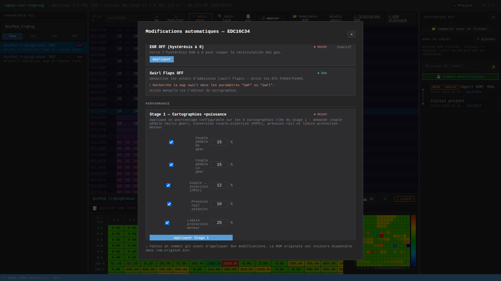

Dans la modal, section **Stage 1 — Cartographies +puissance** :
- `☑ Couple pédale Hi gear` — **15** %
- `☑ Couple pédale Lo gear` — **15** %
- `☑ Couple → Injection (FMTC)` — **12** %
- `☑ Pression rail setpoint` — **10** %
- `☑ Limite protection moteur` — **25** %

Ajuste si tu veux (un Stage 1 « safe » c'est 10/10/8/5/20, un Stage 2 maison c'est 25/25/20/15/40). Clic **`Appliquer Stage 1`**.

Côté serveur : `POST /api/projects/:id/stage1` avec le body `{ pcts: { ... } }` → `applyPctToMap()` de `rom-patcher.js` patche chaque carte, puis `fs.writeFileSync` en un coup. Atomique.

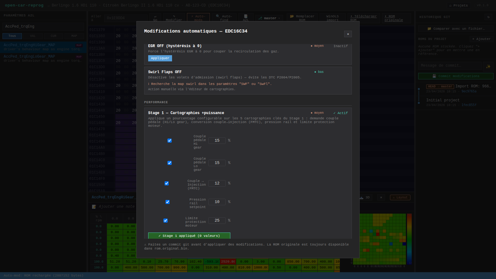

Les 5 zones concernées sont orange dans l'hex editor : `~1300 octets` modifiés sur 2 Mo.

## Étape 7 — Commit git

Ferme la modal (`✕`). Dans le panneau git à droite, clic **`✨`** à côté du champ message : le serveur calcule le diff map-level entre HEAD et la working tree, et propose automatiquement `Stage 1 (5/5 cartes)` :

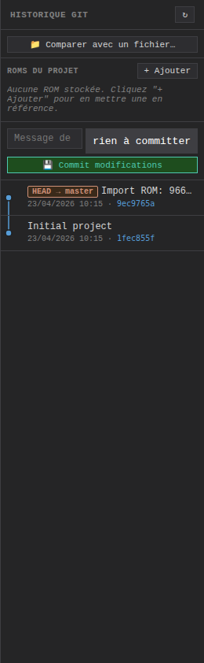

Clic **`💾 Commit modifications`**. Un nouveau commit apparaît dans le log.

Clic sur ce commit → le panneau affiche le **diff map-level** (pas les octets bruts, les cartes A2L) :

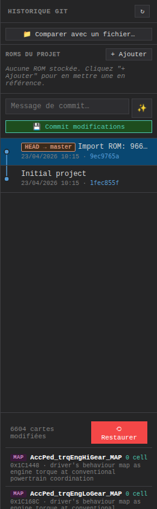

```
5 cartes modifiées                          ⟲ Restaurer

[MAP] AccPed_trqEngHiGear_MAP             256 cells
  2400 → 2760 (+360, +15%)
  0x16D6C4 · driver's behaviour map as engine torque…
[MAP] AccPed_trqEngLoGear_MAP             256 cells
  …
[MAP] FMTC_trq2qBas_MAP                   256 cells
  …
[MAP] Rail_pSetPointBase_MAP              256 cells
  …
[MAP] EngPrt_trqAPSLim_MAP                256 cells
  …
```

## Étape 8 — Vérifier via compare view

Clic sur **`AccPed_trqEngHiGear_MAP`** dans la liste du diff. L'éditeur s'ouvre en **mode comparaison vs parent** :

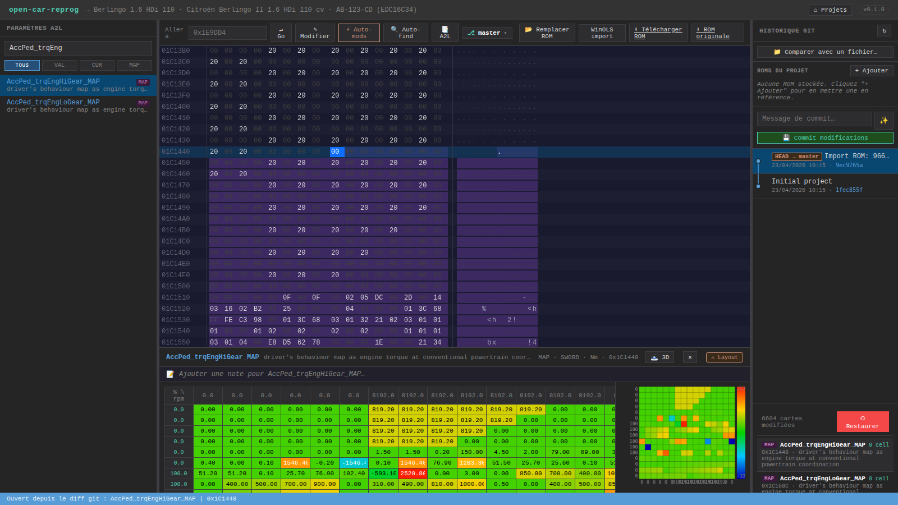

Chaque cellule est **entourée de vert** (augmentée) ou rouge (diminuée). Hover → tooltip `avant: X → après: Y (+Δ)`. Utile pour vérifier qu'aucune cellule n'a pété (clamp à 32767, overflow, etc.).

Ferme la compare view (✕ du banner).

## Étape 9 — Exporter le .bin

Toolbar → **`⬇ Télécharger ROM`**. Le `.bin` modifié (2 Mo exacts) est prêt à être flashé.

Le flash via MPPS/KESS/Galletto recalcule :
- checksums simples de calibration (somme de contrôle 16 bits sur les zones data)
- signatures MAC/RSA du bootloader si ta ROM contient les sections code

**Ne pas** essayer de corriger les checksums côté app — c'est le job du flasher. Voir [FAQ — Checksums](FAQ#checksums).

---

# Partie 2 — Sans damos matchant ton firmware (cas Berlingo)

Cas réel : tu as une ROM d'un firmware **différent** du damos A2L fourni (ex : Citroën Berlingo II 1.6 HDi 75 cv, SW Bosch `1037383736`). Le damos.a2l ne matche PAS ta ROM, et acheter celui qui correspond coûte 50-200 €.

## Approche 0 — Laisser open_damos faire le job (recommandé)

**[open_damos](Open-DAMOS)** est un damos libre (licence CC0) qui utilise les axes RPM/pédale/pression comme empreintes et scanne ta ROM pour retrouver les maps, **à n'importe quelle adresse**. Tu n'as **rien** à faire de spécial.

Étapes :
1. Importer ta ROM (même celle d'un firmware non-standard)
2. Clic **`⚡ Auto-mods → Appliquer Stage 1`**
3. Le serveur détecte que le damos A2L ne matche pas → fallback open_damos → scan par fingerprint des 5 maps Stage 1 → application directe à leurs vraies adresses

**Exemple validé** sur `9663944680.Bin` (Berlingo II 1.6 HDi 75cv) :

| Map | Adresse ori.BIN (damos) | Adresse Berlingo (open_damos auto) | Δ |
|-----|-------------------------|------------------------------------|----|
| `AccPed_trqEngHiGear_MAP` | `0x1C1448` | **`0x1C162C`** | +484 |
| `AccPed_trqEngLoGear_MAP` | `0x1C168C` | **`0x1C1AB4`** | +1064 |
| `FMTC_trq2qBas_MAP` | `0x1C9AAA` | **`0x1CCAD2`** | +12328 |
| `Rail_pSetPointBase_MAP` | `0x1E726C` | **`0x1F0864`** | +38392 |
| `EngPrt_trqAPSLim_MAP` | `0x1C8838` | **`0x1CB482`** | +11338 |

La réponse du serveur indique `addressSource: "open_damos:fingerprint"` pour chaque map relocalisée. Stage 1 est identique à la Partie 1 — le sujet est totalement transparent pour l'utilisateur.

---

## Approche A — Map-Finder : scanner la ROM

Toolbar → clic **`🔍 Auto-find`**. Le serveur scanne la ROM en ~30 ms :

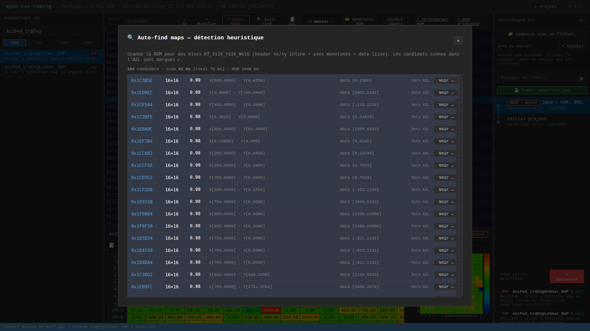

La modal liste les candidats triés par **score** (0..1) :
- Colonne **adresse** hex
- **dimensions** `nx × ny`
- **range data** (min → max raw)
- **range axes** X et Y

Tu vois sur ce Berlingo plusieurs candidats `16×16` à score ~0.95+ : ce sont des cartographies 2D avec header `(nx, ny)` inline + axes monotones + data smooth (typique Bosch).

**Ce que le scanner trouve** : toutes les maps avec layout `Kf_Xs16_Ys16_Ws16` (header `nx, ny` en UWORD BE au début du bloc).

**Ce qu'il ne trouve pas** (⚠ important pour ce tuto) : les 5 cartes Stage 1 d'EDC16C34. Ces maps utilisent un layout à **dimensions fixes déclarées dans le RECORD_LAYOUT A2L** (pas de header inline). Sans A2L, tu ne peux pas distinguer leurs octets de simple data raw. C'est la limite de l'heuristique — elle est documentée dans [Map-Finder — Limites](Map-Finder#limites).

Conclusion : **Map-Finder seul ne suffit pas pour un Stage 1 sur EDC16C34**. Il sert à explorer et trouver d'autres cartes (timing, pilotage turbo, corrections air/carbu…). Pour les cartes Stage 1, il te faut soit l'A2L, soit une reference tunée pour comparer.

## Approche B — Compare vs ROM tunée connue

Il existe en ligne (forums ecuconnections, kdfi, damos shared file…) des ROMs tunées connues pour le 1.6 HDi 110. Le repo inclut une référence **`1.7bar boost, Launch Control 2500, Popcorn 4400, 185hp 410nm`** — un tune complet.

L'idée :
1. Upload cette ROM tunée comme **fichier de comparaison**
2. L'app calcule la **diff byte-level** entre ta ROM et cette référence
3. Les adresses qui diffèrent sont les zones qu'**un autre tuner a modifiées** — donc tes cibles potentielles

Depuis le panneau git droite → bouton **`📁 Comparer avec un fichier…`** → sélectionne le `.bin` tuné. Le serveur :
- Garde le buffer en RAM (clé `projectId`)
- Calcule `mapsChanged(stock, tune, a2l.characteristics)` (si A2L dispo) → liste de cartes avec deltas
- Retourne aussi la liste brute des intervalles d'octets modifiés

Résultat sur le Berlingo vs la ROM `1.7bar boost…` :


**Sans A2L**, tu n'auras pas les noms mais tu verras :
- La liste des **intervalles d'octets** qui diffèrent (`0x16D6C4`, `0x16DA04`, `0x1760A4`, `0x17A4A4`, `0x1758E4` apparaîtront dedans pour un Stage 1 + d'autres adresses pour le launch control, popcorn, boost)
- En croisant avec les **candidats Map-Finder**, tu identifies lesquels sont des cartes 2D vs des simples constantes vs des patchs de code.

**Workflow concret sans A2L** :

1. `GET /api/projects/:id/auto-find-maps` → liste des candidats Map-Finder (adresse, dimensions)
2. `POST /api/projects/:id/compare-file` avec la ROM tunée → liste des intervalles modifiés
3. Intersection : les **candidats du finder dont l'adresse tombe dans un intervalle modifié** sont tes cartes Stage 1 avec très forte probabilité.
4. Pour chacun, ouvrir à l'adresse dans l'hex editor, inspecter visuellement la structure.
5. Modifier par patch direct (hex editor) ou via l'éditeur de maps si tu peux forcer les dimensions.

## Approche C — Uploader un damos tiers

La solution la plus propre : si tu trouves un A2L partiel ou complet pour ton ECU (damos shared file, forum), tu peux l'**uploader en tant que A2L du projet** :

- Toolbar → **`📑 A2L`**
- Sélectionne le fichier `.a2l`
- Le serveur le parse à chaud (plusieurs secondes si gros), cache le résultat dans `projects/<uuid>/custom.a2l.cache.json`
- Les paramètres de **ce projet** utilisent ce A2L au lieu du catalog ECU
- Ton panneau de paramètres à gauche est maintenant peuplé → tu retombes sur le workflow Partie 1

Voir [Paramètres A2L — A2L personnalisé par projet](Parametres-A2L#a2l-personnalisé-par-projet).

## Approche D — Le hex editor sec, adresses forum

Dernière option (la plus manuelle) : tu connais les adresses depuis un forum (ecuconnections, dieseltune, ecumaster…) — tu les tapes dans **`Aller à`** de l'hex editor et tu patches les octets à la main. Laborieux pour 256 cellules × 5 maps, mais utile pour un DPF OFF ou un EGR (quelques octets).

---

# Récapitulatif

| Situation | Workflow recommandé |
|-----------|---------------------|
| **ECU supporté + A2L catalog** (ex: EDC16C34) | Partie 1 — Auto-mods + Stage 1 preset, 2 min |
| **ECU non supporté, pas d'A2L** | Approche A + B combinées — map-finder + compare vs tuné, puis patch hex |
| **ECU non supporté mais A2L dispo (forum/damos)** | Upload A2L custom (Approche C) → retour au workflow de la Partie 1 |
| **Juste quelques adresses à changer** (DPF, EGR, limiteur vitesse) | Hex editor + `Aller à`, Approche D |

La puissance d'open-car-reprog sur le non-A2L vs un éditeur hex sec :
- **Map-Finder** identifie automatiquement ~95 % des cartes 2D avec score et stats
- **Compare-file** te donne un diff map-level si tu as un A2L, sinon un diff byte-level ciblé
- **Git intégré** : toutes tes tentatives de reverse sont versionnées, tu peux toujours revenir en arrière
- **Multi-ROM slots** : garde en référence 2-3 ROMs de la même famille pour des compares rapides

---

# Voir aussi

- [Tutoriel général](Tutoriel) — version courte du workflow complet
- [Auto-mods](Auto-mods) — détail des 7 modifications auto
- [Templates véhicule](Templates-vehicule) — presets one-click par voiture
- [Map-Finder](Map-Finder) — algo heuristique en détail
- [Workflow git](Workflow-git) — branches pour tester plusieurs variantes de Stage 1
- [ECUs supportés](ECUs-supportes) — comment ajouter un nouvel ECU au catalog
- [FAQ — Checksums](FAQ#checksums) — pourquoi l'app ne les calcule pas
