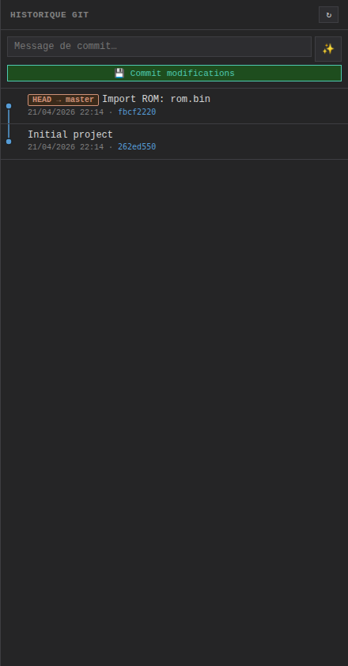
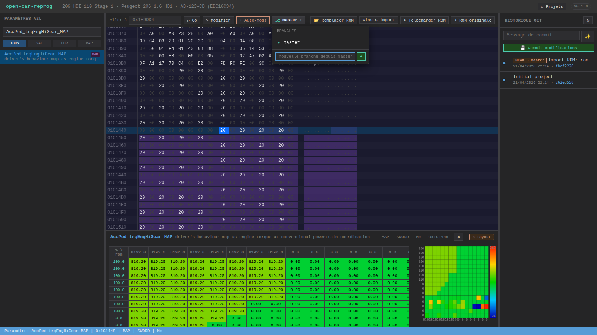
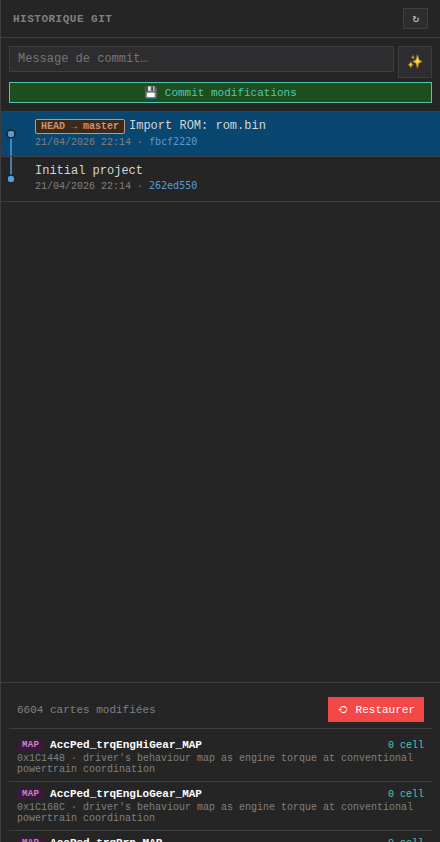
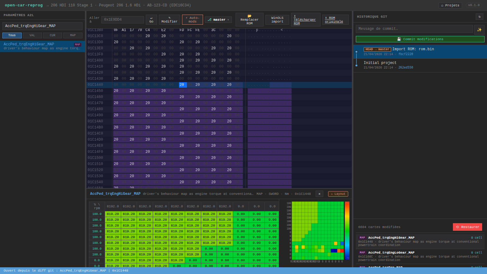
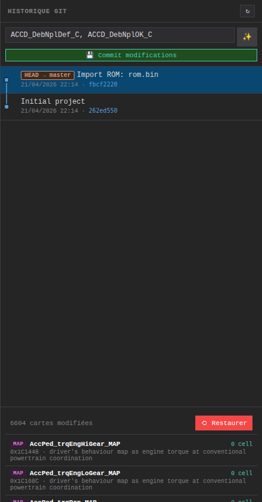
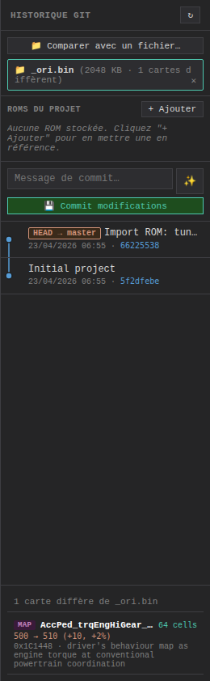
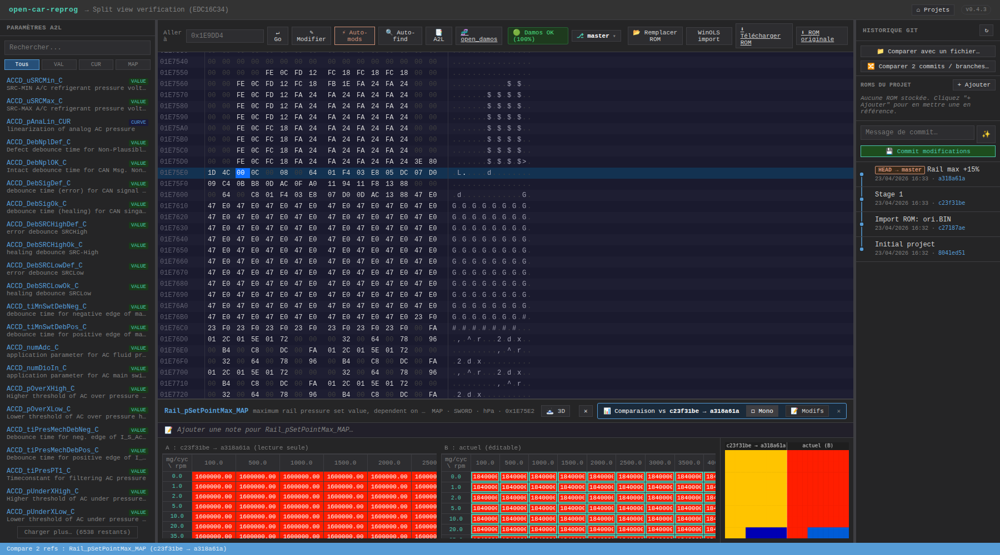
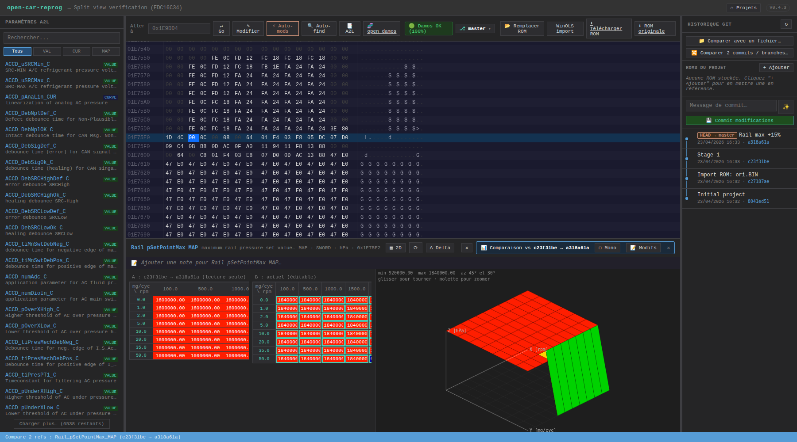
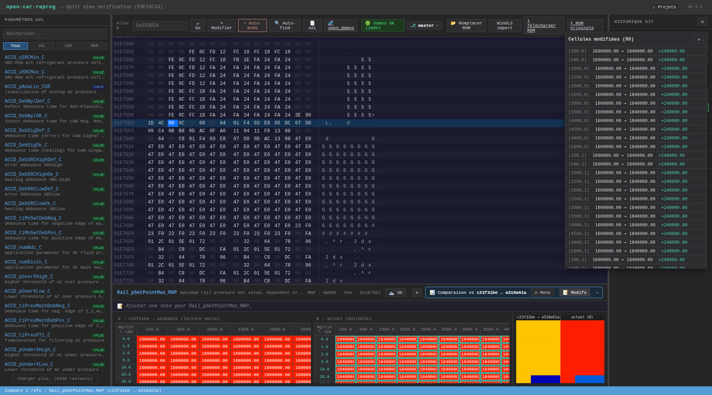

# Workflow git

Le cœur différenciateur d'open-car-reprog vs WinOLS : **chaque projet est un vrai repo git dédié**. Cela donne gratuitement historique, branches, diff, restore et merge — là où WinOLS ne fait que des snapshots linéaires.

---

## Vue d'ensemble du panneau git



Le panneau de droite contient, de haut en bas :
- **Champ de message de commit** + bouton **✨** pour auto-suggestion
- Bouton **`💾 Commit modifications`**
- **Graph des commits** (SVG) avec lanes colorées par branche
- (Quand un commit est sélectionné) **Diff map-level** + bouton **`⟲ Restaurer`**

---

## Branches



Le dropdown **`⎇ <branche> ▾`** de la toolbar gère les branches git du projet :

- **Switch** → click sur une branche dans la liste. L'éditeur recharge le bon ROM.
- **Créer** → taper un nom dans `nouvelle branche depuis <courante>` + Entrée. La nouvelle branche hérite de l'historique de la courante.
- **Supprimer** → icône 🗑 à droite d'une branche non courante. Le bouton est désactivé sur la branche active (sécurité).

### Auto-commit des changements en cours (WIP)

Si tu switches avec des octets modifiés **déjà patchés sur disque** (via `Ctrl+S`) mais pas encore commités, le serveur auto-commit comme `WIP on <branche>` avant de checkout la nouvelle branche. **Aucun travail perdu.**

Si tu as des octets modifiés **en mémoire uniquement** (pas encore `Ctrl+S`), le client affiche une confirmation `"Modifications non sauvegardées dans l'éditeur — elles seront perdues en changeant de branche"`. C'est ton filet de sécurité.

### Cas d'usage classiques

| Scénario | Actions |
|----------|---------|
| Essayer un Stage 2 sans abandonner Stage 1 | Depuis `stage1`, créer `stage2` → appliquer les modifs Stage 2 → commit. Tu alternes en 1 clic. |
| Faire varier un seul paramètre | Depuis `stage1`, créer `stage1-pressrail-+5` → modifier la pression rail → commit → comparer via diff map-level |
| Revenir à un état antérieur sans casser l'historique | `⟲ Restaurer` sur un commit → ça crée un nouveau commit qui replace le ROM à cet état |
| Repartir de zéro | Créer une nouvelle branche `neutral` depuis un ancien commit propre |

---

## Graph

Les commits sont rendus en SVG, un par ligne :

- **Cercle coloré** : un commit (couleur = lane = branche)
- **Ligne verticale** : continuité d'une branche
- **Diagonale** : divergence (fork) ou merge
- **Badge `HEAD → stage1`** (orange) : commit actuel + branche courante
- **Badge `master`** (bleu) : tip d'une autre branche
- **Badge `tag: v1.0`** (vert) : tag éventuel

L'algorithme de lanes (`computeLanes` dans `public/js/components/git-panel.js`) parcourt les commits newest-first, assigne chacun à la lane qui l'attend, ou ouvre une nouvelle lane si personne ne l'attend, merge les lanes qui convergent.

---

## Diff map-level



Click sur un commit → le panneau affiche **la liste des paramètres A2L modifiés**, pas des octets bruts :

```
7 cartes modifiées                         ⟲ Restaurer

[MAP] AccPed_trqEngHiGear_MAP           2 cells
  500 → 600 (+100, +20%)
  0x1C1448 · driver's behaviour map as engine torque…

[CURVE] Rail_pSetPointBase_MAP          16 cells
  1200 → 1380 (+180, +15%)
  0x17A4A4 · rail pressure setpoint base

[VALUE] AirCtl_nOvrRun_C                1 cell
  1000 → 4400 (+3400, +340%)
  0x1C4046 · overrun threshold RPM
```

Chaque ligne montre :
- **Tag type** coloré (MAP violet, CURVE bleu, VAL_BLK vert, VALUE jaune)
- **Nom** de la caractéristique
- **Cells changed** (nombre de cellules SWORD qui diffèrent)
- **Échantillon** : 1 cellule avant → après + delta absolu et relatif
- **Adresse** + début de description

### Algo de détection

Côté backend (`src/map-differ.js`) :
1. Calcul des intervalles d'octets qui diffèrent entre `parent_buffer` et `commit_buffer`
2. Pour chaque caractéristique A2L, calcul de sa région `[address, address + size)` en utilisant le RECORD_LAYOUT + `maxAxisPoints`
3. Si la région overlap un intervalle de diff → la carte est dans le résultat
4. Tri par **tightness** (cellsChanged / totalCells) pour mettre en tête les fit exacts (VALUE qu'on a changé précisément) vs les gros MAPs sparsely touchés

Click sur une ligne → l'éditeur de maps s'ouvre en [compare view](#compare-view) et l'hex editor saute à l'adresse.

---

## Compare view



Quand tu cliques une carte depuis le diff d'un commit, l'éditeur s'ouvre en **mode comparaison vs le commit parent** :

- Cellules **entourées de vert** : valeur augmentée
- Cellules **entourées de rouge** : valeur diminuée
- Hover → tooltip `avant: 50.00 → actuel: 70.00 (+20.00)`
- Banner en haut à droite : `📊 Comparaison vs "<commit>"` avec bouton `✕` pour revenir en mode édition

Sous le capot : l'app appelle `/api/projects/:id/rom?commit=<parent_hash>` pour récupérer le buffer parent, puis l'éditeur lit les valeurs aux mêmes adresses dans les 2 buffers et applique les bordures colorées sur les cellules.

---

## Auto-suggest commit message



Bouton **✨** à côté du champ message OU focus sur un champ vide → le serveur calcule le diff map-level **entre HEAD et la working tree** (changements non committés) et propose un message :

| Situation | Exemple de message |
|-----------|--------------------|
| 1 carte modifiée avec fit exact | `ACCD_uSRCMin_C +360%` |
| Stage 1 pattern (≥3/5 cartes canoniques) | `Stage 1 (5/5 cartes)` |
| 2-4 cartes diverses | `AirCtl_nOvrRun_C, AirCtl_qOvrRun_C` |
| Beaucoup de changements | `5 cartes : ACCD_DebNplDef_C, ACCD_DebNplOK_C, …` |
| Rien de modifié | Bouton flash `rien à committer` |

Tu peux éditer le message avant d'appuyer `💾 Commit modifications`.

---

## Compare vs fichier externe (.bin)



Tu as un `.bin` tuné trouvé sur un forum et tu veux voir **ce qui diffère vs ton projet** ? Le bouton **`📂 Comparer fichier…`** de la toolbar ouvre un sélecteur :

1. Upload du `.bin` de référence → le serveur calcule le diff map-level entre le ROM courant et ce fichier (buffer gardé en RAM tant que tu ne ferms pas le projet).
2. Liste des cartes qui diffèrent, triée par tightness, identique au diff git.
3. Click sur une carte → éditeur s'ouvre en **compare view vs ce fichier externe** (même logique que compare vs parent git, mais avec un banner `📊 Comparaison vs <fichier>.bin`) :


- Cellules vertes : plus hautes dans le fichier externe
- Cellules rouges : plus basses
- Hover → tooltip avec les 2 valeurs

Utilisé typiquement pour :
- Extraire les adresses tunées d'un `.bin` tiers vers son propre projet
- Vérifier qu'un Stage 1 maison est cohérent avec une référence connue
- Identifier les zones « hors scope » (sections code modifiées = souvent un flasher qui a repackagé la calibration autrement)

Le bouton **`✕`** du banner libère le buffer en RAM côté serveur.

---

## Compare 2 commits / branches arbitraires 🔀

Bouton **`🔀 Comparer 2 commits / branches…`** dans la zone compare du panneau git. Ouvre un modal avec 2 dropdowns :

- **Avant (A)** et **Après (B)** — peuplés avec :
  - Les branches d'abord (`⎇ main`, `⎇ stage1`, `⎇ stage2-launch`…)
  - Puis tous les commits du log (hash court + message + refs)

Click **`Comparer →`** → liste map-level des cartes qui diffèrent, triée par tightness (fits exacts en haut). Click sur une carte → l'éditeur s'ouvre en compare mode entre **les deux buffers A et B** (ne touche pas à la working tree).

Cas d'usage : comparer 2 branches de tuning (`stage1` vs `stage2`), comparer un commit d'il y a 3 jours avec HEAD, comparer deux versions d'un même tune juste avant de décider laquelle flasher.

Endpoint : `GET /api/projects/:id/git/diff-maps-between/:refA/:refB` — accepte hash complet, hash court, branch, tag, `HEAD~N`, etc.

---

## Split view — 2 ROMs côte à côte ⇄

Quand l'éditeur est en compare mode, bouton **`⇄ Split`** dans la bannière compare. Active un split complet :

- **Tableau 2D** : 2 tables côte à côte, A (lecture seule) à gauche, B (éditable) à droite, **scroll synchronisé** ligne-à-ligne
- **Heatmap 2D** : canvas coupé en 2 quadrants, `min/max` commun → couleurs directement comparables
- **Surface 3D** (si `🗻 3D` activé) : 2 surfaces côte à côte, rotations synchronisées, même échelle Z




Toggle `⇄ Split` → `◻ Mono` pour revenir au tableau unique.

---

## Liste cliquable des cellules modifiées 📝

En compare mode, bouton **`📝 Modifs`** dans la bannière → panneau flottant à droite listant toutes les cellules qui diffèrent :

```
Cellules modifiées (96)
───────────────────────
[3000, 1700]   2500.00 → 3250.00   +750.00
[3000, 1500]   2200.00 → 2860.00   +660.00
[3500, 1700]   2000.00 → 2600.00   +600.00
...
```

- Triées par **magnitude de delta desc** (plus grosses modifs en haut)
- Format : coordonnées physiques (rpm, pédale %, mg/cyc…), valeur avant → après, delta coloré vert (augmenté) / rouge (diminué)
- **Click sur une ligne** → scroll vers la cellule dans le tableau B avec **flash doré 1.5 s** pour la repérer
- Fonctionne pour **MAP** et **CURVE**



---

## Restauration

Bouton **`⟲ Restaurer`** dans le diff map-level d'un commit → ramène le ROM à cet état via :

```bash
git checkout <hash> -- rom.bin
git add rom.bin
git commit -m "Restored to <hash8>"
```

C'est **non destructif** : la restauration est elle-même un commit, loggé dans l'historique. Tu peux "restaurer la restauration" si tu changes d'avis.

---

## Sous le capot

- **`simple-git`** npm pour les opérations haut niveau
- **`git show <hash>:rom.bin`** via `execFile` pour lire les buffers binaires
- Le repo git vit dans `projects/<uuid>/.git/`
- L'utilisateur git est configuré en local au projet : `user.email=reprog@local`, `user.name=open-car-reprog`

Tu peux **ouvrir `projects/<uuid>`** dans n'importe quel client git externe (gitk, GitKraken, ligne de commande) pour voir le même historique.
